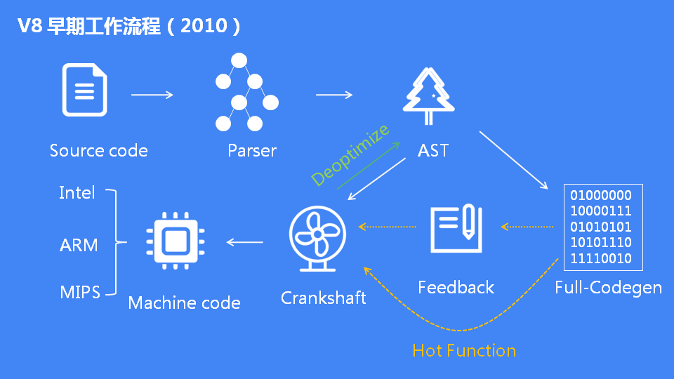
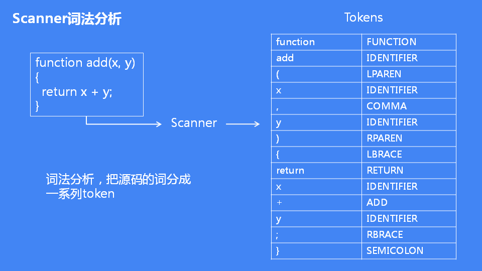

# JS代码是如何被解析执行的？

## JS引擎

> 虚拟机：一种特殊的软件，可以在计算机平台和终端用户之间创建一种环境，使得终端用户可以基于该软件所创建的环境来操作软件。有系统虚拟机和程序虚拟机之分：
> - 系统虚拟机 - 可以运行完整的操作系统，如 VMware
> - 程序虚拟机 - 也叫进程虚拟机，支持单个进程，可以运行单个计算机程序，例如 Java 虚拟机

**定义：** JS 引擎是一种虚拟机，是 JS 代码的运行环境，其作用就是将 JS 代码编译成机器可理解执行的机器代码，JavaScript解析引擎就是能够“读懂”JavaScript代码，并准确地给出代码运行结果的一段程序。比方说，当你写了 `var a = 1 + 1` 这样一段代码，JavaScript引擎做的事情就是看懂（解析）你这段代码，并且将a的值变为2。

### JS引擎与渲染引擎

渲染引擎渲染页面，JS 引擎执行 JS 代码
- 渲染引擎通过 JS 引擎提供的调用接口，使用 JS 引擎处理 JS 代码并获得结果
- JS 引擎通过桥接接口访问或修改渲染引擎生成的 DOM 树
  

### 编译器 VS 解释器

**编译型语言**：程序在执行之前需要一个专门的编译过程，把程序编译成 为机器语言的文件，运行时不需要重新翻译，直接使用编译的结果就行了。程序执行效率高，依赖编译器，跨平台性差些。如C、C++、go等.

**解释型语言**：程序不需要编译，程序在运行时才翻译成机器语言（所以执行前需要环境中安装了解释器），每执行一次都要翻译一次。因此效率比较低。效率比较低，依赖解释器，跨平台性好，如 Python、JS 等。

作为动态/解释执行的 JS，与静态/编译执行语言相比，低性能特性几乎是与生俱来的，制约其性能的因素主要有：

1. 类型，JS 是无类型的语言，对象标识和属性访问比静态语言存在更大的性能损失

2. 解释执行，JS 无法像静态语言那样通过预编译转变成速度更快的本地代码

### js引擎是解释器or编译器

JavaScript 引擎既可以是解释器，也可以是编译器，甚至是两者的结合体。

**解释器**：在解释器模式下，JavaScript 引擎会逐行解释源代码，并将其转换为机器代码，然后立即执行。这种方式的好处是可以快速执行代码，但每次运行都需要解释源代码，可能会导致性能损失。

**编译器**：在编译器模式下，JavaScript 引擎会将整个源代码文件转换为机器代码，然后执行机器代码。这种方式的好处是可以提高执行速度，因为不需要每次运行都重新解释代码。V8 引擎就是一个采用编译器的例子，它会将 JavaScript 代码编译成中间代码，然后再执行。

**即时编译器（JIT 编译器)**：还有一种常见的方式是即时编译器，它将源代码解释成中间代码，并且在执行过程中将频繁执行的部分编译成机器代码，以提高执行速度。这种方式结合了解释器和编译器的优点，既可以快速执行代码，又可以提高性能。

**执行原理如下：**

> - **编译器**：将源代码编译成抽象语法树（AST），在一些引擎中，编译器还负责将 AST 转换成字节码
> 
> - **解释器**：主要解释执行字节码，同时依赖垃圾回收机制
>
> - **JIT 工具**：即时编译工具，将 AST 或字节码转换成本地代码，同时依赖解释器告知哪些代码执行频次高
>
> - **垃圾回收器和分析工具**：负责垃圾回收和收集引擎中的信息，帮助改善引擎性能

## 解析流程
### v8架构

### 宏观流程

>1. **生成抽象语法树AST(Parse)**

>2. **生成字节码BytecodeGenerator(Ignition)**

>3. **执行字节码（BytecodeExecution）**

>4. **Turbofan**

参考 https://cloud.tencent.com/developer/article/1554112

### **微观流程**

>1. **词法分析（Lexical Analysis）**
>
>   v8解析器（parse）首先会对代码进行词法分析，将代码字符串分解成一个个的**词法单元（Token）**，比如关键字、标识符、运算符、分号等。
>
> 2. **语法分析（Syntax Parsing）**
>
>   在词法分析之后，引擎会将这些**词法单元**转换成一个个的语法结构，构建出**抽象语法树（Abstract Syntax Tree，AST）**。语法分析阶段会检查代码是否符合 JavaScript 的语法规范（ECMAScript），并在此过程中进行语法错误的检测。
> 
> 3. **执行上下文创建（Execution Context Creation）**
>
>   在代码执行之前，JavaScript 引擎会创建全局执行上下文，并将其推入执行上下文栈（Execution Context Stack）中。此后，每当函数被调用时，都会创建一个新的执行上下文，并被推入执行上下文栈的顶部。
> 
> 4. **执行代码**
>
>   引擎会按照执行上下文栈的顺序逐个执行其中的代码。在执行过程中，会根据代码的类型执行不同的操作，比如声明变量、执行函数、计算表达式等。
> 
> 5. **变量和函数声明**
>
>   在执行代码的过程中，JavaScript 引擎会将变量和函数的**声明提升（Hoisting）**，即在代码执行前先进行声明，但初始化留在原处。这意味着变量和函数可以在声明之前被使用，但如果初始化在声明之后，则会出现未定义的行为。
> 
> 6. **执行栈管理**
>
>   在函数调用时，会创建对应的执行上下文，并将其推入执行上下文栈的顶部；当函数执行完毕或返回时，对应的执行上下文会被从栈顶弹出，控制权交还给上一个执行上下文。
> 
> 7. **内存管理**
>
>   在代码执行过程中，JavaScript 引擎会负责对内存的管理，包括变量的分配、垃圾回收等操作，确保代码的正常执行和内存的有效利用。

### 词法分析

词法分析就是把源码的字符串按照 ECMAScript 标准分割出来，生成一系列的（记号流）token，如下图可知不同的字符串对应不同的token类型。

  

## 核心原理

从JS引擎的执行流程来看，JS 引擎的核心实现原理历经以下几种方式：

> 1. **遍历语法树**
>     
> 2. **字节码方式**
>
> 3. **JIT编译方式**
>
> 4. **WebAssembly**

### 遍历语法树

### 字节码方式

### JIT编译方式

### WebAssembly