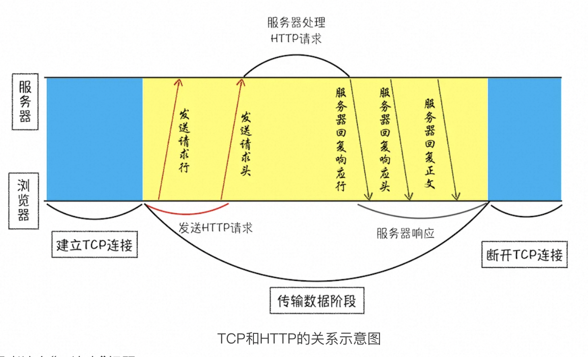

# HTTP 请求流程

## 浏览器端发起 HTTP 请求流程

#### 构建请求

首先，浏览器构建请求行信息（如下所示），构建好后，浏览器准备发起网络请求。

```js
GET /index.html HTTP1.1
```

#### 查找缓存

在真正发起网络请求之前，浏览器会先在浏览器缓存中查询是否有要请求的文件。其中，**浏览器缓存是一种在本地保存资源副本，以供下次请求时直接使用的技术**。

当浏览器发现请求的资源已经在浏览器缓存中存有副本，它会拦截请求，返回该资源的副本，并直接结束请求，而不会再去源服务器重新下载。这样做的好处有：

- 缓解服务器端压力，提升性能（获取资源的耗时更短了）
- 对于网站来说，缓存是实现快速资源加载的重要组成部分
  当然，如果缓存查找失败，就会进入网络请求过程了。

#### 准备 IP 地址和端口

浏览器使用**HTTP 协议作为应用层协议**，用来封装请求的文本信息；并使用**TCP/IP 作传输层协议**将它发到网络上，所以在 HTTP 工作开始之前，浏览器需要通过 TCP 与服务器建立连接。也就是说**HTTP 的内容是通过 TCP 的传输数据阶段来实现的**，你可以结合下图更好地理解这二者的关系。



- HTTP 网络请求的第一步是做什么呢？结合上图看，**是和服务器建立 TCP 连接**。
- 获取建立连接的信息，**需要准备 IP 地址和端口号**。
- 利用**URL 地址来获取 IP 和端口信息**，URL 域名映射为 IP 的系统就叫做“**域名系统**”，简称**DNS**

**第一步浏览器会请求 DNS 返回域名对应的 IP**。当然浏览器还提供了 DNS 数据缓存服务，如果某个域名已经解析过了，那么浏览器会缓存解析的结果，以供下次查询时直接使用，这样也会减少一次网络请求。

拿到 IP 之后，接下来就需要获取端口号了。通常情况下，如果 URL 没有特别指明端口号，那么 HTTP 协议默认是 80 端口。

#### 等待 TCP 队列

现在已经把端口和 IP 地址都准备好了，那么下一步是不是可以建立 TCP 连接了呢？

答案依然是“不行”。Chrome 有个机制，同一个域名同时最多只能建立 6 个 TCP 连接，如果在同一个域名下同时有 10 个请求发生，那么其中 4 个请求会进入排队等待状态，直至进行中的请求完成。

当然，如果当前请求数量少于 6，会直接进入下一步，建立 TCP 连接。

#### 建立 TCP 连接

排队等待结束之后，终于可以快乐地和服务器握手了，在 HTTP 工作开始之前，浏览器通过 TCP 与服务器建立连接。

#### 发送 HTTP 请求

一旦建立了 TCP 连接，浏览器就可以和服务器进行通信了。而 HTTP 中的数据正是在这个通信过程中传输的。


发送**请求行**，就是告诉服务器浏览器需要什么资源，最常用的请求方法是 Get。比如，直接在浏览器地址栏键入极客时间的域名（time.geekbang.org），这就是告诉服务器要 Get 它的首页资源。

另外一个常用的请求方法是 POST，它用于发送一些数据给服务器，比如登录一个网站，就需要通过 POST 方法把用户信息发送给服务器。如果使用 POST 方法，那么浏览器还要准备数据给服务器，这里准备的数据是通过请求体来发送。

在浏览器发送请求行命令之后，还要以请求头形式发送其他一些信息，把浏览器的一些基础信息告诉服务器。比如包含了浏览器所使用的操作系统、浏览器内核等信息，以及当前请求的域名信息、浏览器端的 Cookie 信息，等等。

## 为什么很多站点第二次打开速度会很快？
