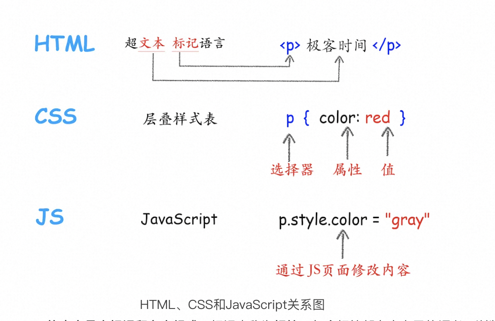
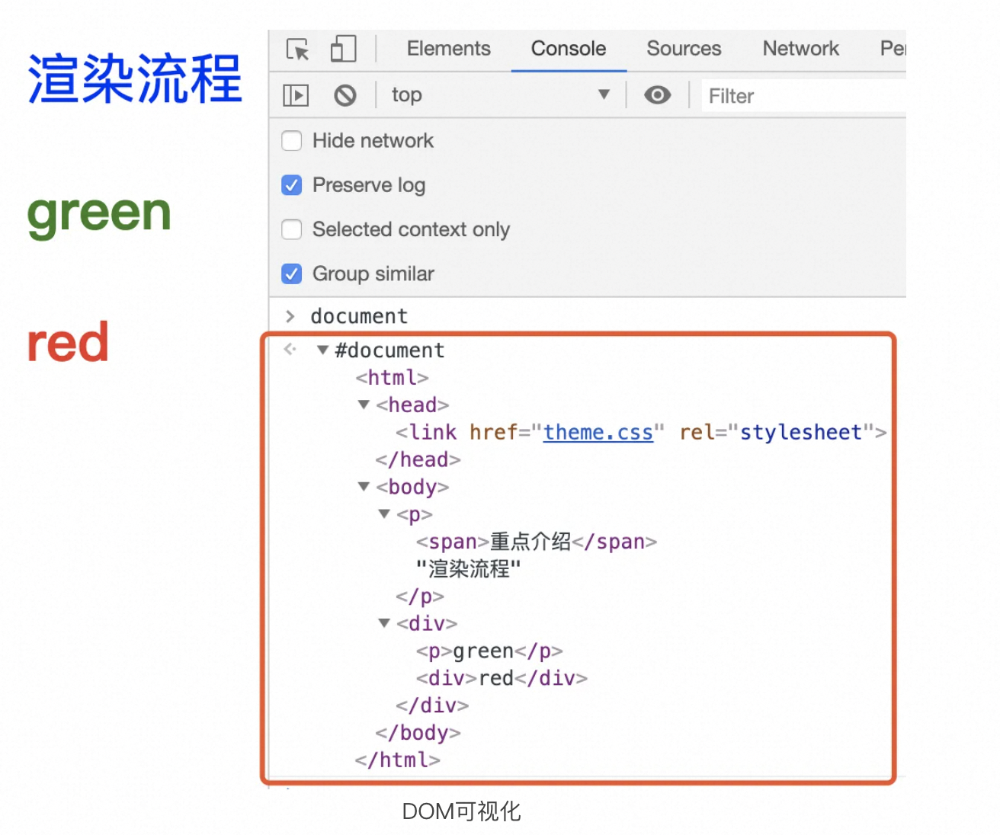
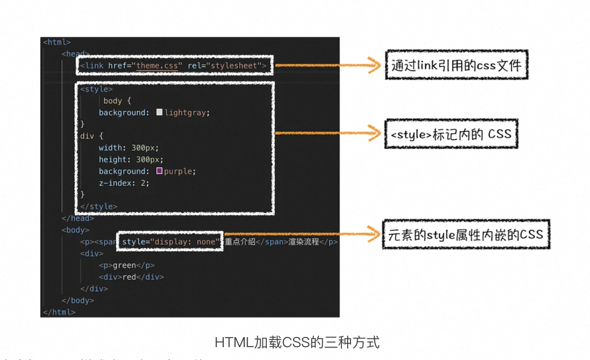
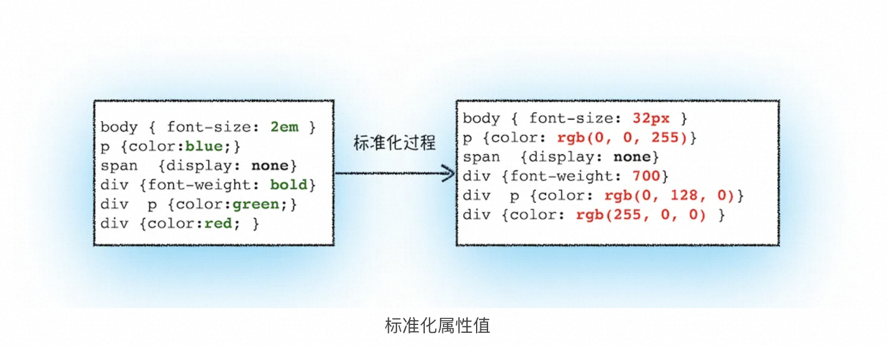
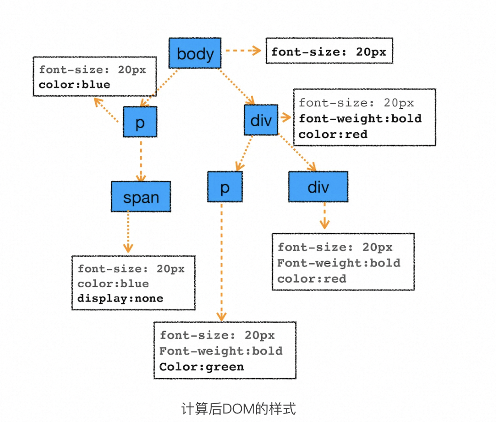
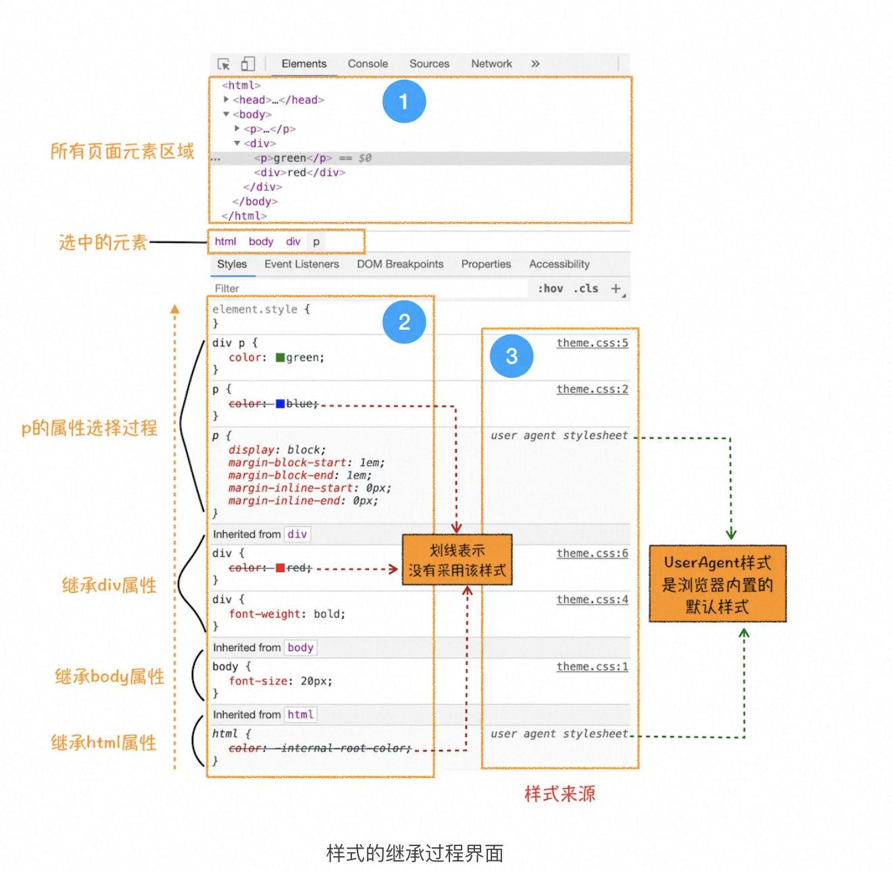
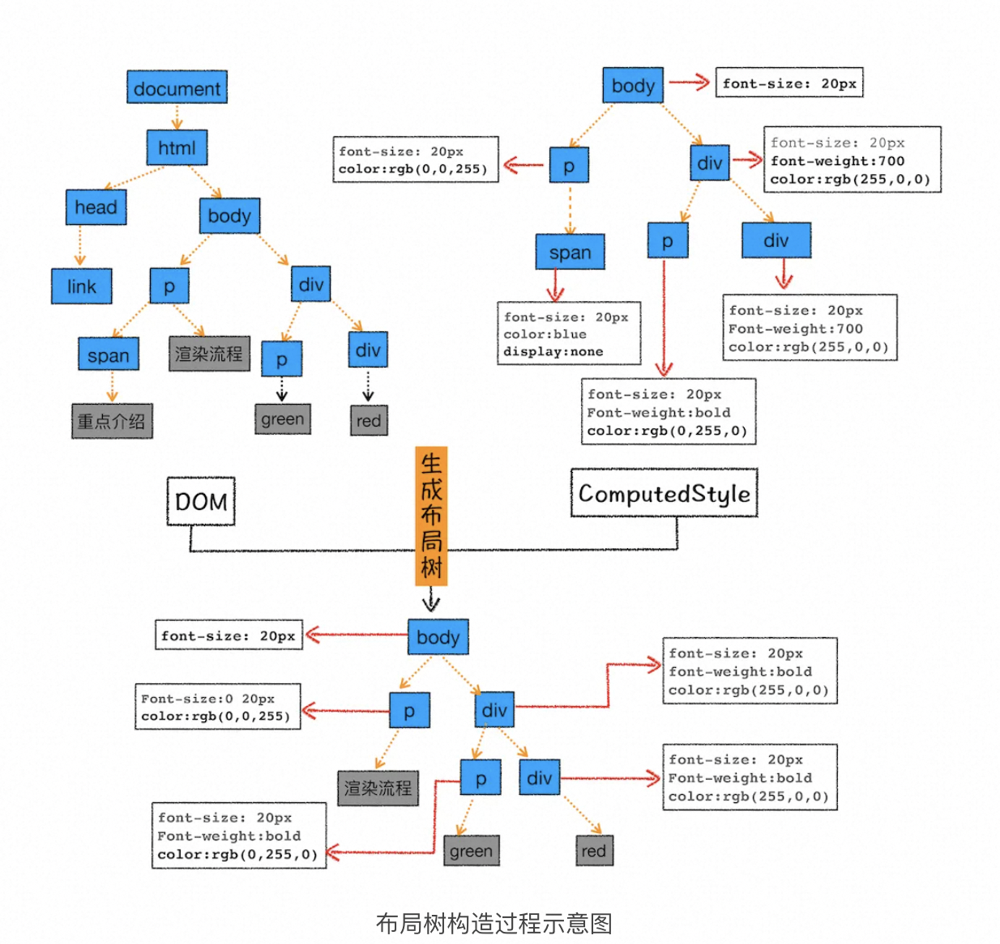

# 渲染流程（上）

> 导航被提交后又会怎么样呢？就进入了渲染阶段。这个阶段很重要，了解其相关流程能让你“看透”页面是如何工作的，有了这些知识，你可以解决一系列相关的问题，比如能熟练使用开发者工具，因为能够理解开发者工具里面大部分项目的含义，能优化页面卡顿问题，使用 JavaScript 优化动画流程，通过优化样式表来防止强制同步布局，等等。

为了能更好地理解下文，你可以先结合下图快速抓住 HTML、CSS 和 JavaScript 的含义：


从上图可以看出，**HTML 的内容是由标记和文本组成**。标记也称为标签，每个标签都有它自己的语义，浏览器会根据标签的语义来正确展示 HTML 内容。比如上面的`<p>`标签是告诉浏览器在这里的内容需要创建一个新段落，中间的文本就是段落中需要显示的内容。

如果需要改变 HTML 的字体颜色、大小等信息，就需要用到 CSS。CSS 又称为**层叠样式表，是由选择器和属性组成**，比如图中的 p 选择器，它会把 HTML 里面`<p>`标签的内容选择出来，然后再把选择器的属性值应用到`<p>`标签内容上。选择器里面有个 color 属性，它的值是 red，这是告诉渲染引擎把`<p>`标签的内容显示为红色。

至于 JavaScript（简称为 JS），**使用它可以使网页的内容“动”起来**，比如上图中，可以通过 JavaScript 来修改 CSS 样式值，从而达到修改文本颜色的目的。

由于渲染机制过于复杂，所以渲染模块在执行过程中会被划分为很多子阶段，输入的 HTML 经过这些子阶段，最后输出像素。我们把这样的一个处理流程叫做渲染流水线，其大致流程如下图所示：


按照渲染的时间顺序，流水线可分为如下几个子阶段：构建 DOM 树、样式计算、布局阶段、分层、绘制、分块、光栅化和合成。内容比较多，我会用两篇文章来为你详细讲解这各个子阶段。接下来，在介绍每个阶段的过程中，你应该重点关注以下三点内容：

- 开始每个子阶段都有其输入的内容；
- 然后每个子阶段有其处理过程；
- 最终每个子阶段会生成输出内容。

## 构建 DOM 树

为什么要构建 DOM 树呢？**这是因为浏览器无法直接理解和使用 HTML，所以需要将 HTML 转换为浏览器能够理解的结构——DOM 树**。

DOM 树的构建过程:


从图中可以看出，构建 DOM 树的**输入内容**是一个非常简单的 HTML 文件，然后经由 HTML 解析器解析，最终输出树状结构的 DOM。

为了更加直观地理解 DOM 树，你可以打开 Chrome 的“开发者工具”，选择“Console”标签来打开控制台，然后在控制台里面输入“document”后回车，这样你就能看到一个完整的 DOM 树结构，如下图所示：


图中的 document 就是 DOM 结构，你可以看到，DOM 和 HTML 内容几乎是一样的，但是和 HTML 不同的是，DOM 是保存在**内存中树状结构**，可以通过 JavaScript 来查询或修改其内容。

## 样式计算（Recalculate Style）

样式计算的目的是为了计算出 DOM 节点中每个元素的具体样式，这个阶段大体可分为三步来完成。

#### 1. 把 CSS 转换为浏览器能够理解的结构

那 CSS 样式的来源主要有哪些呢？你可以先参考下图：


从图中可以看出，CSS 样式来源主要有三种：

- 通过 link 引用的外部 CSS 文件
- `<style>`标记内的 CSS
- 元素的 style 属性内嵌的 CSS

和 HTML 文件一样，浏览器也是无法直接理解这些纯文本的 CSS 样式，所以当**渲染引擎接收到 CSS 文本时，会执行一个转换操作，将 CSS 文本转换为浏览器可以理解的结构——styleSheets**。

为了加深理解，你可以在 Chrome 控制台中查看其结构，只需要在控制台中输入 document.styleSheets，然后就看到如下图所示的结构：


从图中可以看出，这个样式表包含了很多种样式，已经把那三种来源的样式都包含进去了。当然样式表的具体结构不是我们今天讨论的重点，你只需要知道渲染引擎会把获取到的 CSS 文本全部转换为 styleSheets 结构中的数据，并且该结构同时具备了查询和修改功能，这会为后面的样式操作提供基础。

#### 2.转换样式表中的属性值，使其标准化

现在我们已经把现有的 CSS 文本转化为浏览器可以理解的结构了，那么接下来就要对其进行属性值的标准化操作。

要理解什么是属性值标准化，你可以看下面这样一段 CSS 文本：

```css
body {
  font-size: 2em;
}
p {
  color: blue;
}
span {
  display: none;
}
div {
  font-weight: bold;
}
div p {
  color: green;
}
div {
  color: red;
}
```

可以看到上面的 CSS 文本中有很多属性值，如 2em、blue、bold，这些类型数值不容易被渲染引擎理解，所以**需要将所有值转换为渲染引擎容易理解的、标准化的计算值**，这个过程就是属性值标准化。



#### 3.计算出 DOM 树中每个节点的具体样式

**这就涉及到 CSS 的继承规则和层叠规则了。**

首先是 CSS 继承。**CSS 继承就是每个 DOM 节点都包含有父节点的样式**。这么说可能有点抽象，我们可以结合具体例子，看下面这样一张样式表是如何应用到 DOM 节点上的。

```css
body {
  font-size: 2em;
}
p {
  color: blue;
}
span {
  display: none;
}
div {
  font-weight: bold;
}
div p {
  color: green;
}
div {
  color: red;
}
```

这张样式表最终应用到 DOM 节点的效果如下图所示：



从图中可以看出，所有子节点都继承了父节点样式。比如 body 节点的`font-size`属性是 20，那 body 节点下面的所有节点的`font-size`都等于 20。



这个界面展示的信息很丰富，大致可描述为如下。

- 首先，可以选择要查看的**元素的样式（位于图中的区域 2 中）**，在图中的第 1 个区域中点击对应的元素，就可以在下面的区域查看该元素的样式了。比如这里我们选择的元素是`<p>`标签，位于`html.body.div`.这个路径下面。
- 其次，可以从**样式来源（位于图中的区域 3 中）**中查看样式的具体来源信息，看看是来源于样式文件，还是来源于 UserAgent 样式表。**这里需要特别提下 UserAgent 样式，它是浏览器提供的一组默认样式，如果你不提供任何样式，默认使用的就是 UserAgent 样式**。
- 最后，可以通过区域 2 和区域 3 来查看样式继承的具体过程。
  以上就是 CSS 继承的一些特性，样式计算过程中，会根据 DOM 节点的继承关系来合理计算节点样式。

样式计算过程中的第二个规则是样式层叠。**层叠是 CSS 的一个基本特征，它是一个定义了如何合并来自多个源的属性值的算法。它在 CSS 处于核心地位，CSS 的全称“层叠样式表”正是强调了这一点**。关于层叠的具体规则这里就不做过多介绍了，网上资料也非常多，你可以自行搜索学习。

总之，样式计算阶段的目的是为了计算出 DOM 节点中每个元素的具体样式，在计算过程中需要遵守 CSS 的继承和层叠两个规则。这个阶段最终输出的内容是每个 DOM 节点的样式，并被保存在 ComputedStyle 的结构内。

## 布局阶段

现在，我们有 DOM 树和 DOM 树中元素的样式，但这还不足以显示页面，因为我们还不知道 DOM 元素的几何位置信息。那么接下来就需要计算出 DOM 树中可见元素的几何位置，我们把这个计算过程叫做布局。

Chrome 在布局阶段需要完成两个任务：创建布局树和布局计算。

#### 1. 创建布局树

你可能注意到了 DOM 树还含有很多不可见的元素，比如 head 标签，还有使用了 display:none 属性的元素。所以在显示之前，我们还要额外地构建一棵只包含可见元素布局树。



从上图可以看出，DOM 树中所有不可见的节点都没有包含到布局树中。

为了构建布局树，浏览器大体上完成了下面这些工作：

- 遍历 DOM 树中的所有可见节点，并把这些节点加到布局树中；
- 而不可见的节点会被布局树忽略掉，如 head 标签下面的全部内容，再比如 body.p.span 这个元素，因为它的属性包含 dispaly:none，所以这个元素也没有被包进布局树。

#### 2.布局计算

现在我们有了一棵完整的布局树。那么接下来，就要计算布局树节点的坐标位置了。布局的计算过程非常复杂，我们这里先跳过不讲，等到后面章节中我再做详细的介绍。

在执行布局操作的时候，会把布局运算的结果重新写回布局树中，所以布局树既是输入内容也是输出内容，这是布局阶段一个不合理的地方，因为在布局阶段并没有清晰地将输入内容和输出内容区分开来。针对这个问题，Chrome 团队正在重构布局代码，下一代布局系统叫 LayoutNG，试图更清晰地分离输入和输出，从而让新设计的布局算法更加简单。

## HTML、CSS 和 JavaScript，是如何变成页面的？
