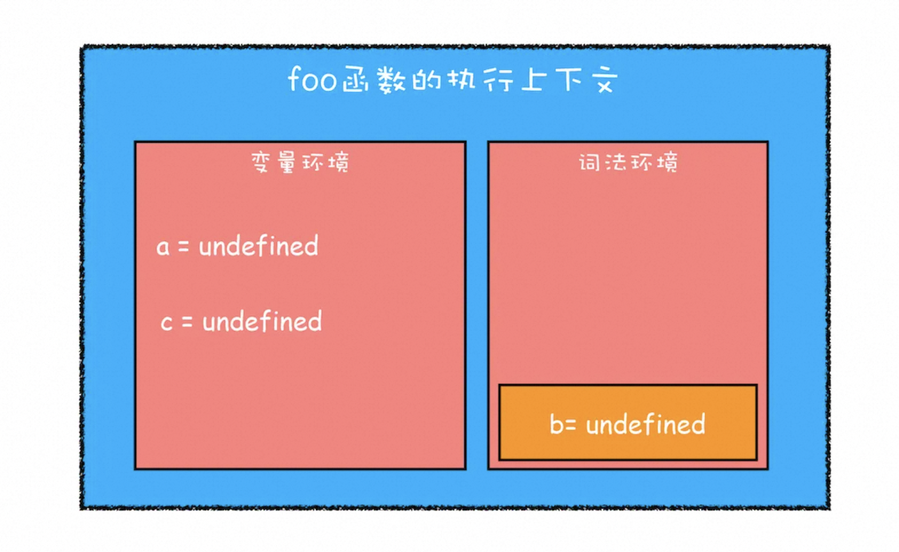
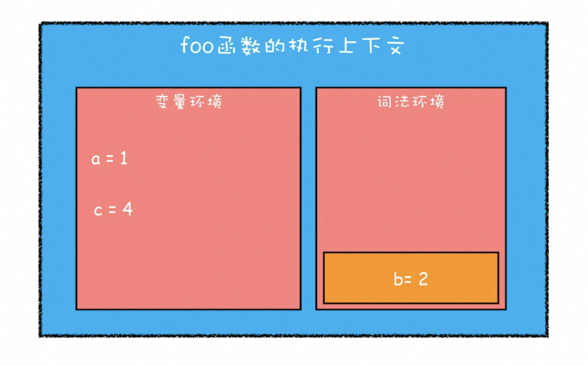

# 块级作用域

**正是由于 JavaScript 存在变量提升这种特性，从而导致了很多与直觉不符的代码，这也是 JavaScript 的一个重要设计缺陷。**

虽然 ECMAScript6（以下简称 ES6）已经通过引入块级作用域并配合 let、const 关键字，来避开了这种设计缺陷，但是由于 JavaScript 需要保持向下兼容，所以变量提升在相当长一段时间内还会继续存在。这也加大了你理解概念的难度，因为既要理解新的机制，又要理解变量提升这套机制，关键这两套机制还是同时运行在“一套”系统中的。

今天我们这篇文章会先“**探病因**”——分析为什么在 JavaScript 中会存在变量提升，以及变量提升所带来的问题；然后再来“**开药方**”——介绍如何通过**块级作用域并配合 let 和 const 关键字**来修复这种缺陷。

## 作用域（scope）

**作用域是指在程序中定义变量的区域，该位置决定了变量的生命周期。通俗地理解，作用域就是变量与函数的可访问范围，即作用域控制着变量和函数的可见性和生命周期。**

在 ES6 之前，ES 的作用域只有两种：全局作用域和函数作用域。

- **全局作用域**中的对象在代码中的任何地方都能访问，其生命周期伴随着页面的生命周期。
- **函数作用域**就是在函数内部定义的变量或者函数，并且定义的变量或者函数只能在函数内部被访问。函数执行结束之后，函数内部定义的变量会被销毁。

在 ES6 之前，JavaScript 只支持这两种作用域，相较而言，其他语言则都普遍支持块级作用域。块级作用域就是使用一对大括号包裹的一段代码，比如函数、判断语句、循环语句，甚至单独的一个{}都可以被看作是一个块级作用域。

```js
//if块
if (1) {
}

//while块
while (1) {}

//函数块
function foo() {}

//for循环块
for (let i = 0; i < 100; i++) {}

//单独一个块
{
}
```

简单来讲，如果一种语言支持块级作用域，那么其代码块内部定义的变量在代码块外部是访问不到的，并且等该代码块中的代码执行完成之后，代码块中定义的变量会被销毁。你可以看下面这段 C 代码：

```c
char* myname = "极客时间";
void showName() {
  printf("%s \n",myname);
  if(0){
    char* myname = "极客邦";
  }
}

int main(){
   showName();
   return 0;
}
```

上面这段 C 代码执行后，最终打印出来的是上面全局变量 myname 的值，之所以这样，是因为 C 语言是支持块级作用域的，所以 if 块里面定义的变量是不能被 if 块外面的语句访问到的。

## 变量提升所带来的问题

#### 变量容易在不被察觉的情况下被覆盖掉

```js
var myname = '极客时间'
function showName() {
  console.log(myname)
  if (0) {
    var myname = '极客邦'
  }
  console.log(myname)
}
showName()
```

执行上面这段代码，打印出来的是`undefined`，而并没有像前面 C 代码那样打印出来“极客时间”的字符串。为什么输出的内容是`undefined`呢？我们再来分析一下。

具体分析过程你可以回顾《调用栈：为什么 JavaScript 代码会出现栈溢出？》

#### 本应销毁的变量没有被销毁

```js
function foo() {
  for (var i = 0; i < 7; i++) {}
  console.log(i)
}
foo()
```

如果你使用 C 语言或者其他的大部分语言实现类似代码，在 for 循环结束之后，i 就已经被销毁了，但是在 JavaScript 代码中，i 的值并未被销毁，所以最后打印出来的是 7。

## ES6 是如何解决变量提升带来的缺陷

为了解决这些问题，ES6 引入了 let 和 const 关键字，从而使 JavaScript 也能像其他语言一样拥有了块级作用域。

```js
let x = 5
const y = 6
x = 7
y = 9 //报错，const声明的变量不可以修改
```

从这段代码你可以看出来，两者之间的区别是，**使用 let 关键字声明的变量是可以被改变的，而使用 const 声明的变量其值是不可以被改变的**。但不管怎样，两者都可以生成块级作用域，为了简单起见，在下面的代码中，我统一使用 let 关键字来演示。

```js
function varTest() {
  var x = 1
  if (true) {
    var x = 2 // 同样的变量!
    console.log(x) // 2
  }
  console.log(x) // 2
}
```

在这段代码中，有两个地方都定义了变量 x，第一个地方在函数块的顶部，第二个地方在 if 块的内部，由于 var 的作用范围是整个函数，所以在编译阶段，`x = undefined`

从执行上下文的变量环境中可以看出，最终只生成了一个变量 x，函数体内所有对 x 的赋值操作都会直接改变变量环境中的 x 值。

所以上述代码最后通过 console.log(x)输出的是 2，而对于相同逻辑的代码，其他语言最后一步输出的值应该是 1，因为在 if 块里面的声明不应该影响到块外面的变量。

既然支持块级作用域和不支持块级作用域的代码执行逻辑是不一样的，那么接下来我们就来改造上面的代码，让其支持块级作用域。

```js
function letTest() {
  let x = 1
  if (true) {
    let x = 2 // 不同的变量
    console.log(x) // 2
  }
  console.log(x) // 1
}
```

**作用域块内声明的变量不影响块外面的变量。**

## JavaScript 是如何支持块级作用域的

不过你是否有过这样的疑问：“在同一段代码中，ES6 是如何做到既要支持变量提升的特性，又要支持块级作用域的呢？”

那么接下来，我们就要站在执行上下文的角度来揭开答案。

```js
function foo() {
  var a = 1
  let b = 2
  {
    let b = 3
    var c = 4
    let d = 5
    console.log(a)
    console.log(b)
  }
  console.log(b)
  console.log(c)
  console.log(d)
}
foo()
```

当执行上面这段代码的时候，JavaScript 引擎会先对其进行编译并创建执行上下文，然后再按照顺序执行代码，关于如何创建执行上下文我们在前面的文章中已经分析过了，但是现在的情况有点不一样，我们引入了 let 关键字，let 关键字会创建块级作用域，那么 let 关键字是如何影响执行上下文的呢？

**第一步是编译并创建执行上下文**



- 函数内部通过 var 声明的变量，在编译阶段全都被存放到**变量环境**里面了。
- 通过 let 声明的变量，在编译阶段会被存放到**词法环境（Lexical Environment）**中。
- 在函数的作用域块内部，通过 let 声明的变量并没有被存放到词法环境中。

**第二步继续执行代码**

当执行到代码块里面时，变量环境中 a 的值已经被设置成了 1，词法环境中 b 的值已经被设置成了 2，这时候函数的执行上下文就如下图所示：


从图中可以看出，当进入函数的作用域块时，作用域块中通过 let 声明的变量，会被存放在词法环境的一个单独的区域中，这个区域中的变量并不影响作用域块外面的变量，比如在作用域外面声明了变量 b，在该作用域块内部也声明了变量 b，当执行到作用域内部时，它们都是独立的存在。

其实，在词法环境内部，维护了一个小型栈结构，栈底是函数最外层的变量，进入一个作用域块后，就会把该作用域块内部的变量压到栈顶；当作用域执行完成之后，该作用域的信息就会从栈顶弹出，这就是词法环境的结构。需要注意下，我这里所讲的变量是指通过 let 或者 const 声明的变量。

再接下来，当执行到作用域块中的`console.log(a)`这行代码时，就需要在词法环境和变量环境中查找变量 a 的值了，具体查找方式是：沿着词法环境的栈顶向下查询，如果在词法环境中的某个块中查找到了，就直接返回给 JavaScript 引擎，如果没有查找到，那么继续在变量环境中查找。


当作用域块执行结束之后，其内部定义的变量就会从词法环境的栈顶弹出，最终执行上下文如下图所示：



## 总结

由于 JavaScript 的变量提升存在着变量覆盖、变量污染等设计缺陷，所以 ES6 引入了块级作用域关键字来解决这些问题。

之后我们还通过对变量环境和词法环境的介绍，分析了 JavaScript 引擎是如何同时支持变量提升和块级作用域的。

## 思考

```js
let myname = '极客时间'
{
  console.log(myname)
  let myname = '极客邦'
}
```

你能通过分析词法环境，得出来最终的打印结果吗？
