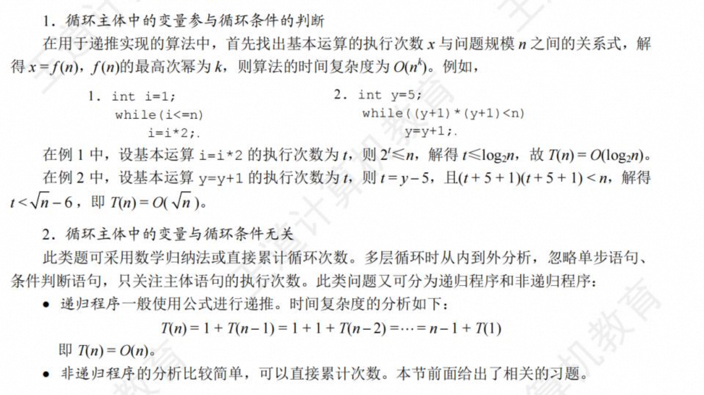

# 第一章 绪论

## 数据结构的基本概念

#### 基本概念

1. 数据

2. 数据元素

数据元素是数据的基本单位

3. 数据对象

数据对象是具有相同性质的数据元素的集合，是数据的一个子集

4. 数据类型

数据类型是 一个值的集合和定义在此集合上的 一组操作的总称。

5. 数据结构

   1)原子类型 2)结构类型 3)抽象数据类型

#### 数据结构三要素

1. 数据的逻辑结构
   逻辑结构是指数据元素之间的逻辑关系，即从逻辑关系上描述数据。
   分为线性结构和非线性结构

2. 数据的存储结构
   存储结构是指数据结构在计算机中的表示 (又称映像)，也称物理结构。它包括数据元素的 表示和关系的表示。 1)顺序存储 2)链式存储 3)索引存储 4)散列存储

3. 数据的运算

## 算法和算法评价

#### 算法的基本概念

算法(Algorithm)是对特定问题求解步骤的一种描述，它是指令的有限序列，其中的每条指 令表示一 个或 多个操 作

#### 算法效率的度量

1. 时间复杂度

一个语句的频度是指该语句在算法中被重复执行的次数。算法中所有语句的频度之和记为 T (n )， 它是该算法问题规模 n 的函数，时间复杂度主要分析 T(n)的数量级。最深层循环中的语句。

分析规则：

1、加法规则 : T(n) = T1(n) + T2(n) = 0 (f (n ) )+ O(g(n) ) = 0 (m a x (f (n )，g (n ) ) )
2、乘法规则: T(m)= T.(n)×T.(n)=O(f(n)×O(g(n)=0(f(n)×g(n)

2. 空间复杂度

算法的空间复杂度 S(n)定义为该算法所需的存储空间，它是问题规模 n 的函数
算法原地工作是指算法所需的辅助空间为常量，即 O(I)

## 复杂度题型分析

