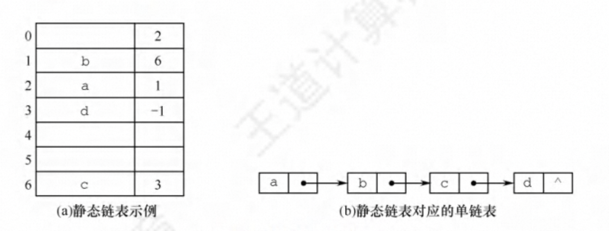

# 第 2 章 线性表

## 线性表的定义和基本操作

### 线性表的定义

线性表是具有相同数据类型的 n 个数据元素的有限序列。

相关概念：表头元素、表尾元素、直接前驱、直接后继

:warning

> - 线性表是一种**逻辑结构**，表示元素之间一对一的相邻关系。顺序表和链表是指存储结构， 两者属于不同层面的概念，因此不要将其混淆。

### 线性表基本操作

- `Initiist(&L)`: 初始化表。构造一个空的线性表
- `Length(L)`: 求表长。 返回线性表工的长度，即中数据元素的个数
- `LocateElem(L,e)`: 按值查找操作。在表 t 中查找具有给定关键字值的元素
- `GetElem(I，主)`:按位查找操作。获取表工中第 i 个位置的元素的值。
- `ListInsert(&L,i,e)`:插入操作。在表工中的第个位置上插入指定元素 e。
- `ListDelete(&L,i，&e)`:删除操作。删除表工中第 i 个位置的元素，并用 e 返回删除元素的值。
- `PrintList(L)`:输出操作。按前后顺序输出线性表 的所有元素值。
- `Empty(L)`:判空操作。若工为空表，则返回 true，否则返回 false。
- `DestroyList(&L)`:销毁操作。销毁线性表，并释放线性表工所占用的内存空间。

## 线性表的顺序表示

### 顺序表的定义

**定义：**线性表的顺序存储又称顺序表。它是用一组地址连续的存储单元依次存储线性表中的数据元 素，从而使得逻辑上相邻的两个元素在物理位置上也相邻。

**特点：**逻辑顺序与其在储的物理顺相同

> 线性表中元素的位序是从 1 开始的，而数组中元素的下标是从 0 开始的。

**数据结构描述**

静态分配

```c
#define MaxSize 50           // 定义线性表的最大长度
typeof struct{
    ElemType data[MaxSize];  // 顺序表的元素
    int length               // 顺序表的当前长度
} SqList;                    // 顺序表的类型定义
```

动态分配

```c
#define InitSize 50           // 表的初始长度
typeof struct{
    ElemType *data;          // 指示动态分配数组的指针
    int MaxSize, length       // 顺序表的当前长度
} SqList;                    // 顺序表的类型定义

// C 的初始动态分配语句为
L.data = (ElemType*)malloc(sizeof(ElemType)*InitSize);

// C ++的初始动态分配语句为
L.data = new ElemType(InitSize);

```

**优点：**
1、支持随机访问，可在 O(1)时间内找到制定元素
2、存储密度高，每个节点只存储数据元素

**缺点：**
1、插入删除需要移动大量元素，插入操作平均需要移动 n/2 个元素，删除操作平均需要移动(n- 1)/2 个元素。
2、顺序存储分配需要一段连续的存储空间，不够灵活

### 顺序表上的基本操作的实现

1. 顺序表的初始化
   静态分配

```c
// 声明一个顺序表
void InitList(SqList &L){
    L.Length = 0;
}

```

动态分配

```c
void InitList(SqList &L){
    L.data = (ElemType *)malloc(MaxSize * sizeof(ElemType));
    L.length = 0;
    L.MaxSize = InitSize;
}
```

2. 插入操作

```c
bool ListInsert(SqList &L, int i ,ElemType e){
    if(i<1 || i > L.length+1) return false; // 判断i(位序)的范围是否有效
    if(L.length >= MaxSize) return false; // 当前存储空间已满，不能插入
    for( int j=L.length; j>=i; j--){
        L.data[j] = L.data[j -1]; // 将第i 个元素及之后的元素后移

    }
    L.data[i - 1 ] = e; // 在位置主处放入e
    L.length++;
    return true;
}
```

最好情况：在表尾插入，时间复杂度 O(1)。
最坏情况：在表头插入，时间复杂度 O(n)。
平均情况：O(n)

3. 删除操作

```c
bool ListDelete(SqList &L, int i ,ElemType &e){
    if(i<1 || i > L.length+1) return false; // 判断i(位序)的范围是否有效
    e = L.data[i-1];
    if(L.length >= MaxSize) return false; // 当前存储空间已满，不能插入
    for( int j=i; j<L.length; j++){
        L.data[j-1] = L.data[j]; // 将第i 个元素及之后的元素前移

    }
    L.length--;
    return true;
}
```

最好情况：在表尾删除，时间复杂度 O(1)。
最坏情况：在表头删除，时间复杂度 O(n)。
平均情况：O(n)

4. 按值查找（顺序查找）

```c
int LocationElem(SqList L ,ElemType e){
    int i;
    for(int i = 0; i < L.length ; i++){
        if(L.data[i] ==e){
            return i+1;
        }
    }
    return 0;
}
```

最好情况：在表头，时间复杂度 O(1)。
最坏情况：在表尾，时间复杂度 O(n)。
平均情况：O(n)

# 线性表的链式表示

## 单链表的定义

线性表的链式存储又称单链表，它是指通过一组任意的存储单元来存储线性表中的数据元素。为了建立数据元素之间的线性关系，对每个链表结点，除存放元素自身的信息之外，还需要存放一个指向其后继的指针。

```c
typeof struct LNode{
    ElemType data; // 数据域
    struct LNode *next; // 指针域
} LNode,*LinkList
```

头指针 L(或 head 等)来标识一个单链表，指出链表的起始地址，头指针为 NULI 时表示一个空表。

为了操作上的方便，在单链表第 一个数据结点之前附加 一个结点，称为头结点。头结点的数据域可以不设任何信息，但也可以记录表长等信息。单链表带头结点时， 头指针 L 指向头结点


头结点和头指针的关系:不管带不带头结点，头指针都始终指向链表的第 一个结点，而头结 点是带头结点的链表中的第 一个结点，结点内通常不存储信息。

### 基本操作的实现

1.  单链表初始化

```c
// 带头节点
bool InitList(LinkList &L){
    L = (LNode*)malloc(sizeof (LNode));
    L ->next = NULL;
    return true;
}

// 不带头节点
bool InitList(LinkList &L){
    L = null;
    return true;
}
```

2. 求表长操作

```c
 // 不带头节点
int Length(LinkList L ){
    int Len = 0;
    LNode *p = L;
    while(p->next != NULL){
        p = p->next;
        Len++;
    }
    return Len
}
```

3. 按序号查找节点

```c
LNode *GetElem(LinkList L ,int i){
    LNode *p = L;
    int j=0;
    while(p !=NULL&&j<i){
        p = p->next;
        j++;
    }
    return p;

}
```

4. 按值查找表节点

```c
LNode *LocationElem(LinkList L, ElemType e){
    LNode *p = L;
    while(p != NULL&&p->data != e){
        p = p->next;
    }
    return p;

}
```

5. 插入结点操作

分前插法和后插法


```c
// 找到第i-1的节点，再其后插入
bool ListInsert(LinkList &L , int i , ElemType e){
    LNode *p = L;
    int j=0;
    while( p!= NULL&& j<i-1){
        p = p->next;
        j++;
    }

    if( p ==NULL) return false;
    LNode *s = (LNode*)malloc(sizeof(LNode));
    // 后插法
    s->data = e;
    s->next = p->next;
    p->next = s;
    // 前插法 交换思想
    s->next = p->next;
    p->next = s;
    temp = p->data;
    p->data = s->data;
    s->data = temp;

    return true;
}
```

6. 删除结点
   删除结点操作是将单链表的第 i 个结点删除。先检查删除位置的合法性，然后查找表中第 1- 1 个结点，即被删结点的前驱，再删除第之个结点。

```c
bool ListDelete(LinkList &L, int i, ElemType &e){
    LNode *p = L;
    int j=0;
     while( p!= NULL&& j<i-1){
        p = p->next;
        j++;
    }

    if( p ==NULL) return false;
    LNode *q = p->next;
    e = q->data;
    p->next = q->next;
    free(q);
    return true;
}
```

7. 采用头插法建立单链表

```c
LinkList List_HeadInsert(LinkList &L){
    LNode *s;
    int x;
    L = (LNode*)maclloc(sizeof(LNode));
    L-next = NULL;
    scanf("%d",&x);
    while(x!=9999){
        s = (LNode*)malloc(sizeof(LNode));
        s->data = x;
        s->next = L->next;
        L->next = s;
        scanf("%d", &x);
    }

    return L ;
}
```

8. 采用尾插法建立单链表

需增加尾指针 r ，使其始终指向当前链表的尾结点

```c
LinkList List_TailInsert(LinkList &L){
    int x;
    L = (LNode*)malloc(sizeof(LNode));
    LNode *s , *r = L;
    scanf("%d",&x);
    while(x!=9999){
        s = (LNode*)malloc(sizeof(LNode));
        s->data = x；
        r->next = s;
        r = s;
        scanf("%d",&x);
    }
    r->next = NULL;
    return L

}
```

## 双链表

双链表结点中有两个指针`prior`和`next` ，分别指向其直接前驱和直接后继，

结点类型定义

```c
typedef struct DNode{
    ElemType data;
    Struct DNode *prior ,*next;
}DNode , *DNodeList;
```

1. 双链表的插入操作
   p s c 在 p 和 c 中插入 s

```c
s-next = p->next ;
p->next-prior = s;
p->next = s;
s-prior = p
```

2. 双链表的删除操作

删除结点*p 的后继结点 *q

```c
p->next = q->next ;
q->next->prior = p
free(q);
```

## 循环链表

1. 循环单链表
   表尾结点\*r 的 next 域指向 L，故表中没有指针域为 NULL 的结点，因此，循环单链表的判空条件不是头结点的指针是否为空，而是它是否等于头指针 L。
   设的是尾指针工， r- >next 即为头指针，对在表头或表尾插入元素都只需要 O(1)的时间复杂度。
   
2. 循环双链表
   当循环双链表为空表时，其头结点的 prior 域和 next 域都等于 L。
   

## 静态链表

静态链表是用数组来描述线性表的链式存储结构，结点也有数据域 data 和指针域 next， 与前面所讲的链表中的指针不同的是，这里的指针是结点在数组中的相对地址 (数组下标)，又 称游标 。静态链表也要预先分配一块连续的内存空间。


结构类型

```c
#define MaxSize 50;
typedef struct{
    ElemType data;
    int next;
} SLinkList[MaxSize]
```

静态链表以 next==- 1 作为其结束的标志

## 顺序表和链表的比较

1. 存取方式
2. 逻辑结构和物理结构
3. 查找、插入和删除操作
4. 空间分配

**如何选取存储结构**

1. 基于存储考虑
2. 基于运算考虑
3. 基于环境的考虑
