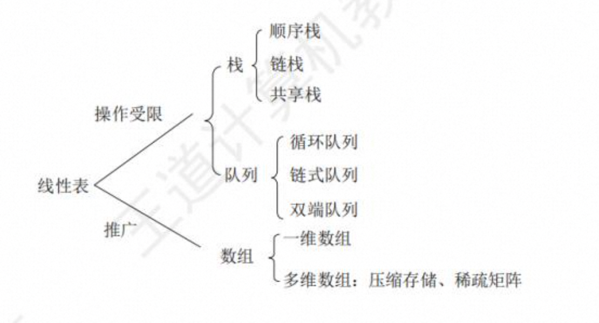
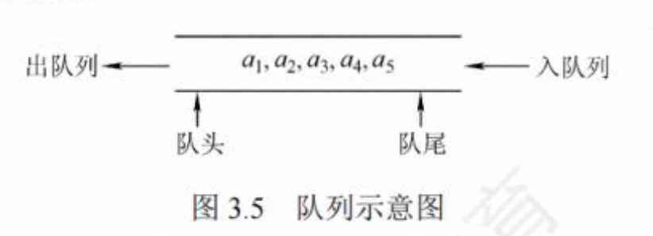
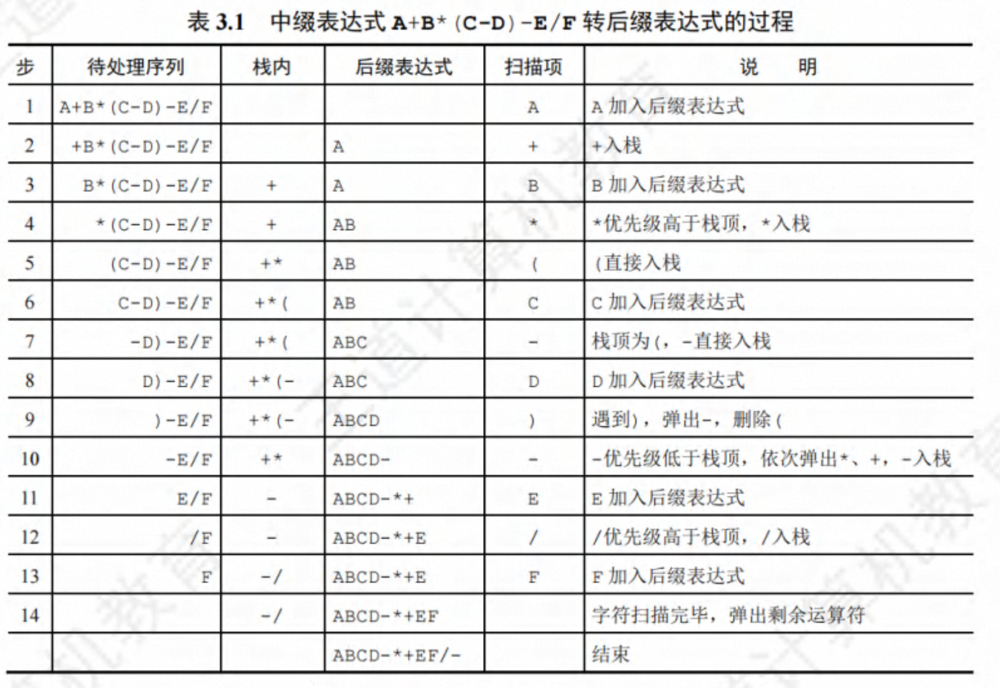
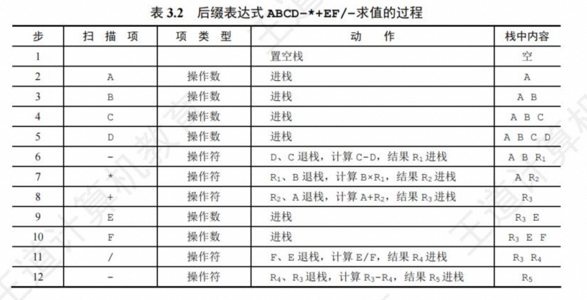
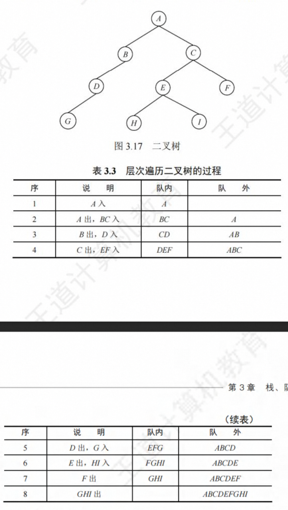

# 栈、队列和数组

**知识框架**



## 栈

#### 栈的基本概念

1. 栈的定义
   `栈(Stack)`是只允许在一端进行插入或删除操作的**线性表**。操作特性概括为`后进先出（LIFO）`

2. 栈的基本操作

• `Initstack(&S)`:初始化一个空栈 S。
• `StackEmpty(S)`:判断一个栈是否为空，若栈 s 为空则返回 true，否则返回 false。
• `Push(&S，x)`:进栈，若栈 s 未满，则将 x 加入使之成为新栈顶。
• `Pop(&S，&x)`:出栈，若栈 s 非空，则弹出栈项元素，并用 x 返回。
• `Get Top (S，&x)`:读栈顶元素，但不出栈，若栈 S 非空，则用 x 返回栈项元素。
• `Destroystack(&S)`:销毁栈，并释放栈 S 占用的存储空间(“&” 表示引用调用)

栈的数学性质：当 n 个不同元素进栈时，出栈元素不同排列的个数为 （1 / n+1）C（n 2n）,这个公式称
为 `卡特兰数(Catalan)`公式，

#### 栈的顺序存储结构

1. 顺序栈的实现

采用顺序存储的栈称为顺序栈，它利用一组地址连续的存储单元存放自栈底到栈项的数据元素，同时附设一个指针`(top)`指示当前栈项元素的位置。

```c
#define MaxSize 50
typeof struct{
   ElemType data[MaxSize];
   int top;
}SqStack;
```

2. 顺序栈的基本操作

**（1）初始化**

```c
void InitStack(SqStack &S){
   S.top = -1;
}
```

**(2) 判栈空**

```c
bool StackEmpty(SqStack S){
   if(S.top === -1)return true;
   return false;
}
```

**(3) 进栈**

```c
bool Push(SqStack &S,ElemType x){
   if(S.top == MaxSize - 1) return false;
   S.data[++S.top] = x; // 指针先加1，再入栈
   return true;
}
```

**（4）出栈**

```c
bool Pop(SqStack &S , ElemType &x){
   if(S.top == -1)return false; // 栈空
   x = S.data[S.top--];
   return true;
}
```

**（5）读栈顶元素**

```c
bool GetTop(SqStack S , ElemType &x){
   if(S.top == -1)return false;
   x = S.data[S.top];
   return true;
}
```

3. 共享栈

利用栈底位置相对不变的特性，可让两个顺序栈共享一个一维数组空间 ，将两个栈的栈底分别设置在共享空间的两端，两个栈项向共享空间的中间延伸。


判空： `top0= -1`时 0 号栈为空，`top1= MaxSize`时 1 号栈为空。
判满： 两个栈项指针相邻 `(top1 - top0 = 1) `时 ， 判断为栈满。
进栈： 当 0 号栈进栈时 `S.data[++S.top0] = x`top0 先加 1 再赋值，1 号栈进栈时 ` S.data[--S.top1] = x`top1 先减 1 再赋值。
出栈： `x = S.data[S.top0--]`,` x = S.data[S.top++];`

#### 栈的链式存储结构

采用链式存储的栈称为链栈，链栈的优点是便于多个栈共享存储空间和提高其效率，且不存 在栈满上溢的情况。通常采用单链表实现，并规定所有操作都是在单链表的表头进行的。这里规 定链栈没有头结点，Lhead 指向栈顶元素。


```c
typedef struct Linknode{
   Elemtype data;
   struct Linknode *next;
}LiStack
```

## 队列

#### 队列的基本概念

1. 队列的定义

`队列 (Queue)`简称队，也是一种操作受限的线性表，只允许在表的一端进行插入，而在表的另 一端进行删除。其操作特性是`先进先出（FIFO）`。`队头(Front)`允许删除的一端，又称队首。 `队尾(Rear)`允许插入的一端。



2. 队列的基本操作

#### 队列的顺序存储结构

1. 队列的顺序存储

队列的顺序实现是指分配一块连续的存储单元存放队列中的元素，并附设两个指针:队头指针 front 指向队头元素，队尾指针 rear 指向队尾元素的下一个位置。

```c
#define MaxSize 50
typedef struct {
   ElemType data[MaxSize];
   int front,rear;
}SqQueue;
```

初始化：`Q.front = Q.rear = 0`;
进队：队不满时，先送值到队尾元素，再将队尾指针加 1。
出队：队不空时，先取队头元素值，再将队头指针加 1

2. 循环队列

初始时:`Q.front = Q.rear = 0`。
队首指针进 1: `Q.front = (Q.front + 1) % Maxsize`。
队尾指针进 1: `Q.rear=(Q.rear+1)%Maxsize`。
队列长度:`(Q.rear+MaxSize-Q.front)&Maxsize`

**循环队列的判空/判满**

三种处理方式：

1. 牺牲一个单元来区分队空和队满，入队时少用一个队列单元，队头指针在队尾指针的下一位置作为队满的标志.

队满条件：`(Q.rear + 1) % MaxSize = Q.front`
队空：`Q.front == q.rear`。
队列中的个数：`(Q.rear - Q.front + MaxSize ) % MaxSize`

2. 类型中增设 size 数据成员，表示元素个数。删除成功 size 减 1，插入成功 size 加 1。队空时 Q.size==0;队满时 Q.size==MaxSize，两种情况都有 Q.front==Q.rear。
3. 类型中增设 tag 数据成员，以区分是队满还是队空。删除成功置 tag=0，若导致 Q.front==Q.rear，则为队空:插入成功置 tag=1，若导致 Q.front==Q.rear，则为队满。

4. 循环队列的操作

（1）初始化

```c
void InitQueue(SqQueue &Q){
   Q.reat = Q.front = 0;
}
```

（2）判队空

```c
bool isEmpty(SqQueue Q){
  if(Q.rear == Q.front) return true ;
  return false;
}
```

（3）判队满

```c
bool isFill(SqQueue Q){
  if((Q.rear+1)%MaxSize == Q.front) return true;
  return false;
}
```

（4）入队

```c
bool EnQueue(SqQueue &Q, ElemType x){
   if(isFill(Q)) return false;
   Q.data[Q.rear] = x;
   Q.rear = (Q.rear + 1)% MaxSize;
   return true;

}
```

（5）出队

```c
bool DeQueue(SqQueue &Q,Elemtype &x){
   if(isEmpty(Q)) return false;
   x = Q.data[Q.front];
   Q.front = (Q.front+1) % MaxSize;
   return true;
}
```

#### 队列的链式存储结构

1. 队列的链式存储
   队列的链式表示称为链队列，它实际上是一个同时有队头指针和队尾指针的单链表

存储类型描述：

```c
typedef struct LinkNode {
   ElemType data;
   struct LinkNode *next;
}LinkNode

typedef struct{
   LinkNode *front,*rear;
}LinkQueue
```

2. 链式队列的基本操作

（1）初始化

```c
void InitQueue(LinkQueue &Q){
   Q.front = Q.rear = (LinkNode *)malloc(sizeof(LinkNode));
   Q.front->next = NULL;

}
```

（2）判队空

```c
bool IsEmpty(LinkQueue Q){
   if(Q.front == Q.rear) return true;
   return false;
}
```

（3）入队

```c
void EnQueue(LinkQueue &Q, ElemType x){
   LinkNode *s = (LinkNode *)malloc(sizeof(LinkNode));
   s->data = x;
   s->next = NULL;
   Q.rear->next = s;
   Q.rear = s;
}
```

（4）出队

```c
// 带头节点
bool DeQueue(LinkQueue &Q , ElemType &x){
   if(IsEmpty(Q))return false;
   LinkQueue *p = Q.front->next;
   x = p->data;
   Q.front->next = p->next;
   if(Q.rear == p) Q.rear = Q.front;
   free(p);
   return true;
}
```

#### 双端队列

双端队列是指允许两端都可以进行插入和删除操作的线性表，将左端也视为前端，右端也视为后端

输入受限、输出受限

## 栈和队列的应用

#### 栈在括号匹配中的应用

算法思想：

> - 初始设置 一个空栈，顺序读入括号。
> - 若是左括号，则作为一个新的更急迫的期待压入栈中，自然使原有的栈中所有未消解的期待的急迫性降了一级。
> - 若是右括号，则或使置于栈顶的最急迫期待得以消解，或是不合法的情况 (括号序列不匹配，退出程序)。算法结束时，栈为空，否则括号序列不匹配

#### 栈在表达式求值中的应用

1. **算术表达式**

中缀表达式`(如3+4)`是人们常用的算术表达式，前缀表达式 `(如+34 )`或后缀表达式 `(如 34 +）`。

与前缀表达式或后缀表达式不同的是，中缀表达式中的括号是必需的。计算过程中必须用括号将操作符和对应的操作数括起来，用于指示运算的次序。后 缀表达式的运算符在操作数后面， 后缀表达式中考虑了运算符的优先级，没有括号，只有操作数和运算符。

后缀表达式与原表达式对应的表达式树的后序遍历相同

2. **中缀表达式转后缀表达式**

1) 按照运算符的运算顺序对所有运算单位加括号。
2) 将运算符移至对应括号的后面，相当于按“左操作数右操作数运算符” 重新组合。
3) 去除所有括号。



栈的深度分析：手工模拟

3. **后缀表达式求值**



#### 栈在递归中的应用

在一个函数、过程或数据结构的定义中又应 用了它自身，则这个函数、过程或数据结构称为是递归定义的，简称递归。

```c
int F(int n ){            // / 斐 波 那 契 数 列 的 实 现
   if(n == 0) return 0;   // 边界条件
   if(n == 1) return 1;   // 边界条件
   return F(n - 1) + F(n - 2);  // 递归表达
}
```

必须满足两个条件：

- 递归表达式（递归体）
- 边界条件（递归出口）

#### 队列在层次遍历中的应用



#### 队列在计算机系统中的应用

- 第一个方面是解决主机与外部设备之间速度不匹配的问题，
- 第二个方面是解决由多用户引起的资源竞争问题

**缓冲区的逻辑结构**

解决解决主机与外部设备之间速度不匹配的问题，设置一个打印数据缓冲区，主机把要打印 输出的数据依次写入这个缓冲区，写满后就暂停输出，转去做其他的事情。打印机就从缓冲区中按照先进先出的原则依次取出数据并打印，打印完后再向主机发出请求。主机接到请求后再向缓冲区写入打印数据。这样做既保证了打印数据的正确，又使主机提高了效率。由此可见，打印数据缓冲区中所存储的数据就是一个队列。

**多队列出队/入队操作的应**
