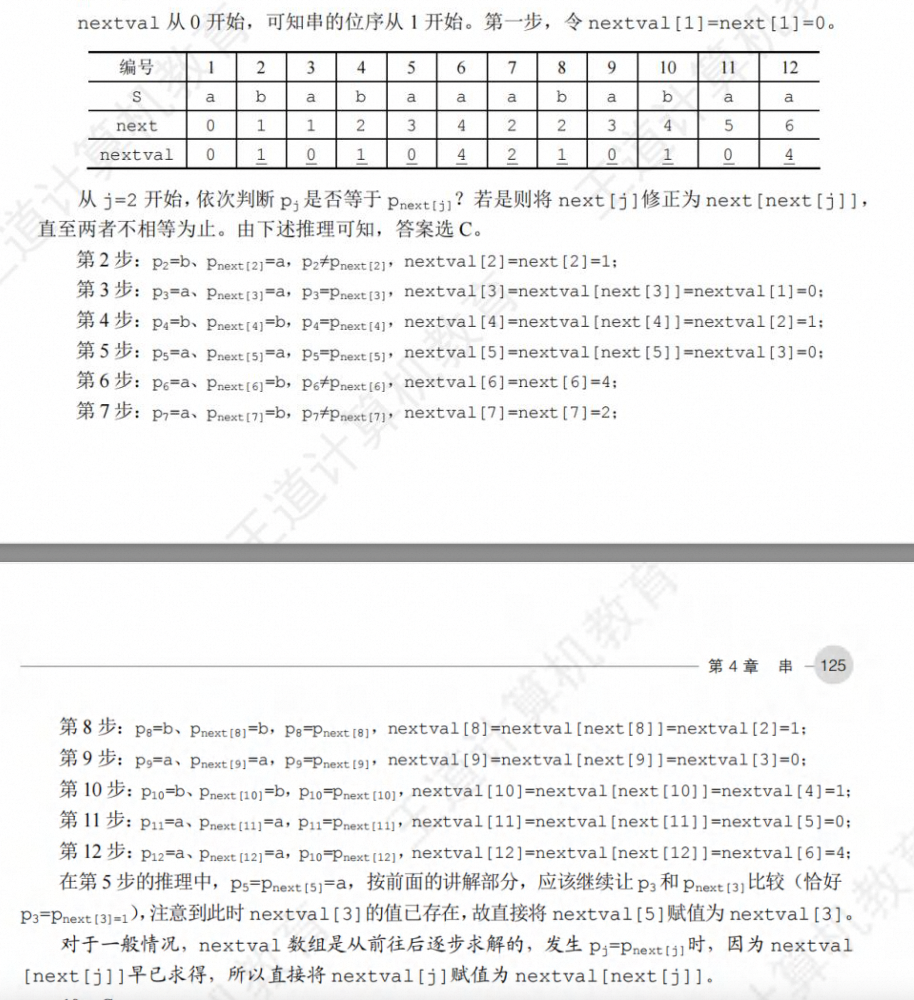

# 第 4 章 串

## 串的定义和实现

#### 串的存储结构

1. 定长顺序存储表示

```c
#define MAXLEN 255;
typedef struct {
  char ch[MAXLEN];
  int length ;
} SString;
```

## 串的模式匹配

#### 简单的模式匹配算法

子串的定位操作通常称为串的模式匹配，它求的是子串(常称模式串)在主串中的位置。这 里采用定长顺序存储结构，给出一种不依赖于其他串操作的暴力匹配算法。

```c
int Index (SString S , SString T){
  int i=1,j=1;
  while(i <= S.length &&j <= T.length){
    if(S.ch[i]==T.ch[j]){
      ++i;
      ++j;
    }else{
      i = i - j + 2;
      j = 1;
    }
  }
  if(j>T.length) return i - T.length;
  return 0;
}
```

时间复杂度 O(nm)

> :note 需要多次指针回溯

#### 串的模式匹配算法-—KMP 算法

1. **字符串的前缀、后缀和部分匹配值**

**前缀**指除最后一个字符以外，字符串的所有头部子串;
**后缀**指除第一个字符外，字符串的所有尾部子串;
**部分匹配值**则为字符串的前缀和后缀的最长相等前后缀长度。


这个部分匹配值有什么作用呢?

**移动位数=已匹配的字符数- 对应的部分匹配值**

2. KMP 算法的原理是什么

求部分匹配值、next 数组、nextval


