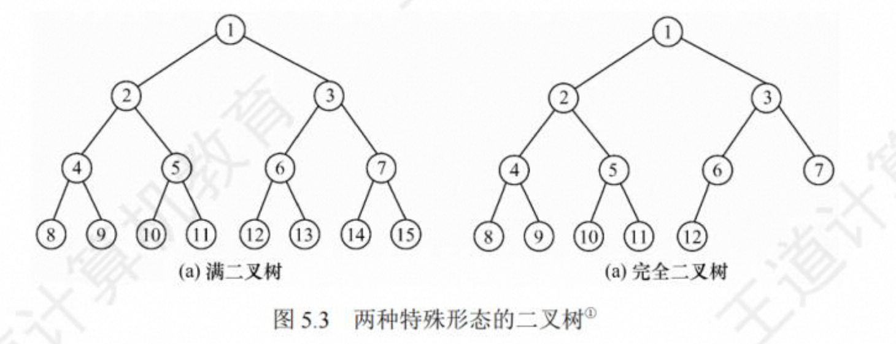

# 第 5 章 树与二叉树

## 树的基本概念

#### 树的定义

1. 有且仅有一个特定的称为**根**的结点。
2. 当 n >1 时，其余结点可分为 m(m>0)个互不相交的有限集 T，T2...，Tm，其中每个集
   合本身又是一棵树，并且称为根的子树

显然，树的定义是递归的，即在树的定义中又用到了其自身，树是 一种递归的数据结构

**特点：**

1. 树的根结点没有前驱，除根结点外的所有结点有且只有一个前驱。
2. 树中所有结点都可以有零个或多个后继。

树适用于表示具有层次结构的数据。树中的某个结点(除根结点外)最多只和上一层的 一个
结点(即其父结点)有直接关系，根结点没有直接上层结点，**因此在 n 个结点的树中有 n- 1 条边**。 而树中每个结点与其下一层的零个或多个结点(即其孩子结点)都有直接关系。

#### 基本术语


1. 祖先、子孙、双亲、孩子、兄弟和堂兄弟
2. 结点的度和树的度
   树中一个结点的**孩子个数称为该结点的度**，树中结点的最大度数称为树的度。如结点 B 的度为 2，结点 D 的度为 3，树的度为 3
3. 分支结点和叶结点
   **度大于 0 的结点称为分支结点(又称非终端结点)**; **度为 0(没有孩子结点)的结点称为叶结点(又称终端结点)**;在分支结点中，每个结点的分支数就是该结点的度。
4. 结点的深度、高度和层次。
   结点的层次从树根开始定义，根结点第 1 层，它的孩子第 2 层，以此类推。结点的深度就是结点所在的层次。树的高度(或深度)是树中结点的最大层数。结点的高度是以该结点为根的子树的高度。图 5.1 中树的高度为 4
5. 有序树和无序树
   树中结点的各子树从左到右是有次序的，不能互换，称该树为有序树，否则称为无序树。
6. 路径和路径长度
   树中两个结点之间的路径是由这两个结点之间所经过的结点序列构成的，而路径长度是路径上所经过的边的个数
7. 森林
   森林是 m(m≥ 0)棵互不相交的树的集合。

#### 树的性质

> 树中结点数和度数的关系的应用(2010、2016)

1. **树的结点数 n 等于所有结点的度数之和加 1**。
   结点的度是指该结点的孩子数量，每个结点与其每个孩子都由唯一的边相连，因此树中 所有结点的度数之和等于树中的边数之和。树中的结点(除根外)都有唯一的双亲，**因此结点数 n 等于边数之和加 1，即所有结点的度数之和加 1**

2. 度为 m 的树中第 i 层上至多有 m^i-1 个结点(i≥1)
   第 1 层至多有 1 个结点(即根结点)，第 2 层至多有 m 个结点，第 3 层至多有 m^2 个结点，以此类推。使用数学归纳法可推出第;层至多有 m^i-1 个结点
3. 高度为 h 的 m 叉树至多有(m^h- 1)/(m- 1)个结点

> 指定结点数的三叉树的最小高度分析 (2022 )


> 常用于求解树结点与度之间关系的有:
> 总结点数=n0+n1+n2+.. +nm。
> 总分支数=1n1+2n2+...+mnm，(度为 m 的结点引出 m 条分支)
> 总结点数= 总分支数 +1

## 二叉树的概念

#### 二叉树的定义及其主要特征

1. 二叉树的定义

2. 几种特殊的二叉树

1） **满二叉树**。 一棵高度为 h，且有 2^h - 1 个结点的二叉树称满二叉树，即二叉树中的每层都含有最多的结点。
2） **完全二叉树**。高度 h、有 n 个结点的二叉树，当且仅当其每个结点都与高度为 h 的满二叉树中编号为 1~n 的结点一一对应时，称为完全二叉树

1️⃣ 若 i≤Ln/2」，则结点 i 为分支结点，否则为叶结点。
2️⃣ 叶结点只可能在层次最大的两层上出现。对于最大层次中的叶结点，都依次排列在该层最左边的位置上。
3️⃣ 若有度为 1 的结点，则最多只可能有一个，且该结点只有左孩子而无右孩子。
4️⃣ 按层序编号后，一旦出现某结点(编号为 i)为叶结点或只有左孩子，则编号大于;的结点均为叶结点。
5️⃣ 若 n 为奇数，则每个分支结点都有左孩子和右孩子:若 n 为偶数，则编号最大的分支结点(编号为 n/2)只有左孩子，没有右孩子，其余分支结点左、右孩子都有 。

3）**二叉排序树**。左子树上所有结点的关键字均小于根结点的关键字;右子树上所有结点的 关 键字均大于根结点的关键字;左子树和右子树又各是一棵二叉排序树

4）**平衡二叉树**。树中任意一个结点的左子树和右子树的高度之差的绝对值不超过 1。

5）**正则二叉树**。树中每个分支结点都有 2 个孩子，即树中只有度为 0 或 2 的结点

3. 二叉树的性质

1）非空二叉树上的叶结点数等于度为 2 的结点数加 1，即 n0 =n2 +1。
设度为 0，1 和 2 的结点个数分别为 n0.n1 和 n2，结点总数 n=n0+n1+n2。
2）非空二叉树的第 k 层最多有 2^(h-1) 个结点(k≥1)
3）高度为 h 的二又树至多有 2^h - 1 个结点


#### 二叉树的存储结构

1. 顺序存储结构
   顺序存储结构 二叉树的顺序存储是指用一组连续的存储单元依次自上而下、自左至右存储完全二叉树上的结点元素，即将完全二叉树上编号为 i 的结点元素存储在一维数组下标为 i-1 的分量中,在最坏情况下，一个高度为 h 且只有 h 个结点的单支树却需要占据近 2^h- 1 个存储单 元
   

   > 建议从数组下标 1 开始存储树中的结点，保证数组下标和结点编号一致。

2. 链式存储结构


```c
typedef struct BiTNode{
  ElemType data;
  struct BiTNode *lchild,*rchild;
}BiTNode,*BiTree
```

> 在 含 有 n 个 结 点 的 二 叉 链 表 中 ， 含 有 n + 1 个 空 链 域

## 二叉树的遍历和线索二叉树

#### 二叉树的遍历

二又树的遍历是指按某条搜索路径访问树中每个结点，使得每个结点均被访问一次，**而且仅被访问一次**

常见的遍历次序有先序(NLR)、中序(LNR)和后序(LRN)三种遍历算法，其中“序”指的是根结点在何时被访问

1. **先序遍历(PreOrder)**

若二叉树为空，则什么也不做:

1. 访问根结点；
2. 先序遍历左子树
3. 先序遍历右子树。

```c
void PreOrder(BiTree T){
   if(T !== NULL){
      visit(T);
      PreOrder(T->lchild);
      PreOrder(T->rchild);
   }
}
```

2. **中序遍历(InOrder)**

若二叉树为空，则什么也不做:

1. 先序遍历左子树
2. 访问根结点；
3. 先序遍历右子树。

```c
void InOrder(BiTree T){
   if(T !== NULL){
      PreOrder(T->lchild);
      visit(T);
      PreOrder(T->rchild);
   }
}
```

2. **后序遍历(PostOrder)**

若二叉树为空，则什么也不做:

1. 先序遍历左子树
2. 先序遍历右子树。
3. 访问根结点；

```c
void InOrder(BiTree T){
   if(T !== NULL){
      PreOrder(T->lchild);
      PreOrder(T->rchild);
      visit(T);
   }
}
```

不管采用哪种遍历算法，每个结点都访问一次且仅访问一次，所以时间复杂度都是 O(n)。在递归遍历中，递归工作栈的栈深恰好为树的深度，所以在最坏情况下，二叉树是有 n 个结点且深度内 n 的单支树，遍历算法的空间复杂度为 O(n)

4. 递归算法和非递归算法的转换

中序：
1️⃣ 沿着根的左孩子，依次入栈，直到左孩子为空，说明已找到可以输出的结点，此时栈内元
素依次为 ABD。
2️⃣ 栈顶元素出栈并访问:若其右孩子为空，继续执行 2️⃣;
3️⃣ 若其右孩子不空，将右子树转执行 1️⃣

```c
void InOrder2(BiTree T){
   InitStack(S);
   BiTree p =T;
   while(p || !IsEmpty(S)){
      if(p){
         Push(S , p);
         p = p->lchild
      }else{
         Pop(S,p);
         visit(p);
         p=p->rchild;
      }
   }
}
```

先序：

```c
void InOrder2(BiTree T){
   InitStack(S);
   BiTree p =T;
   while(p || !IsEmpty(S)){
      if(p){
         visit(p);
         Push(S , p);
         p = p->lchild
      }else{
         Pop(S,p);
         p=p->rchild;
      }
   }
}
```

5. **层次遍历**

进行层次遍历 ，需要借助一个队列。
层次遍历的思想如下:
1️⃣ 首先将二叉树的根结点入队。
2️⃣ 若队列非空，则队头结点出队，访问该结点，若它有左孩子，则将其左孩子入队;若它有右孩子，则将其右孩子入队。
3️⃣ 重复 2 步，直至队列为空。

```c
void LevelOrder(BiTree T ){
   InitQueue(Q);
   BiTree p;
   EnQueue(Q , T);
   while(!IsEmpty(Q)){
      DeQueue(Q,p);
      visit(p);
      if(p->lchild !== NULL) EnQueue(Q,p->lchild);
      if(p->rchild !== NULL) EnQueue(Q,p->rchild);
   }
}
```

6. 由遍历序列构造二叉树

> 先序序列对应的不同二叉树的分析(2015)

对于一棵给定的二叉树，其先序序列、中序序列、后序序列和层序序列都是确定的。然而，只给出四种遍历序列中的任意一种，却无法唯一地确定一棵二叉树。若已知中序序列，再给出其他三种遍历序列中的任意一种，就可以唯一地确定一棵二叉树

(1) 由先序序列和中序序列构造二叉树


(2) 由后序序列和中序序列构造二叉树
(3) 由层序序列和中序序列构造二叉树
