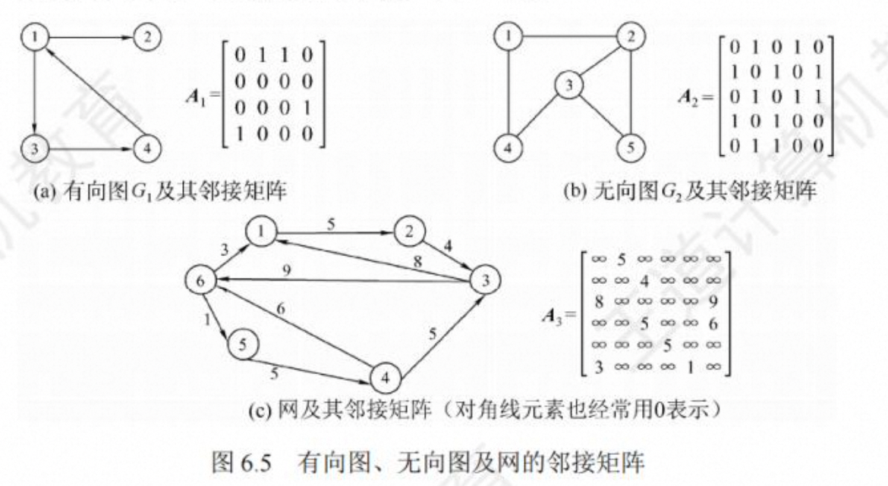
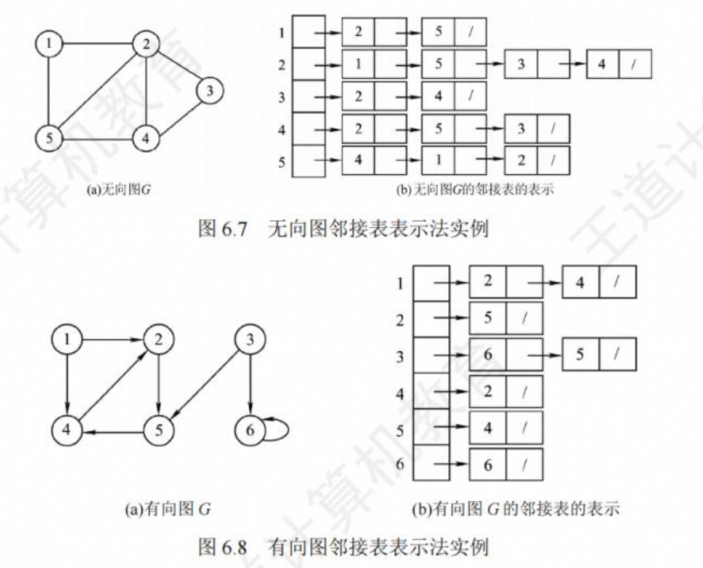
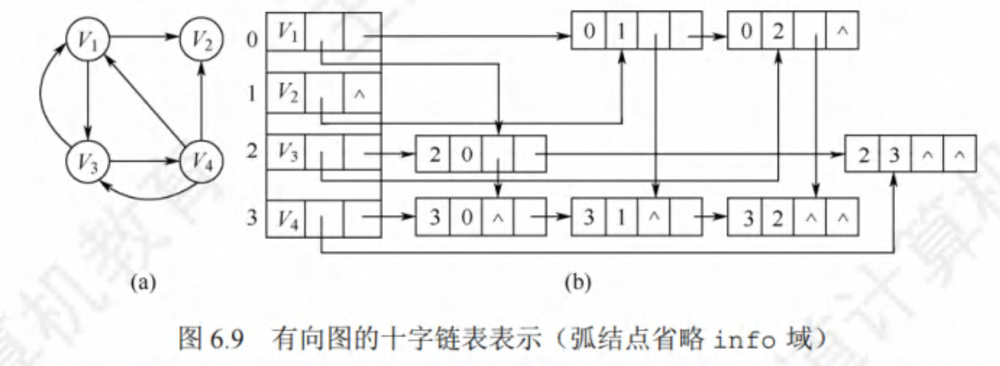
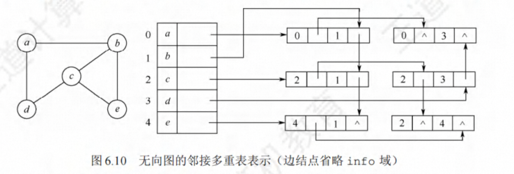
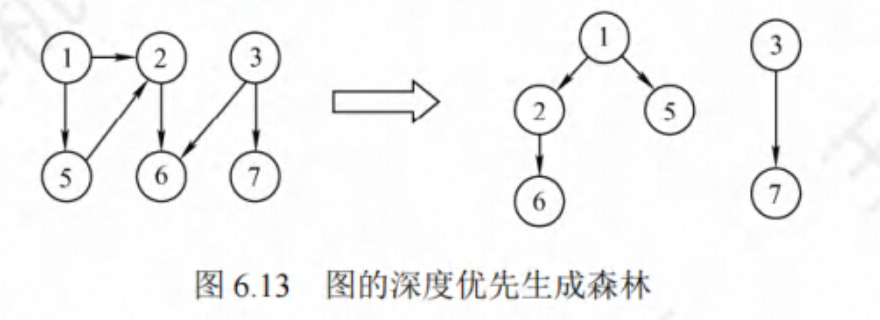
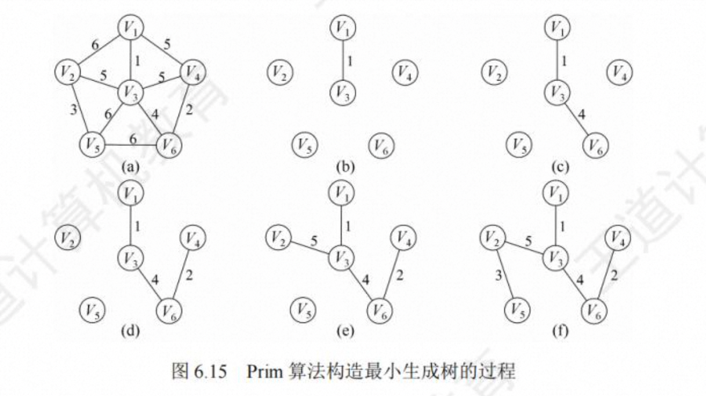
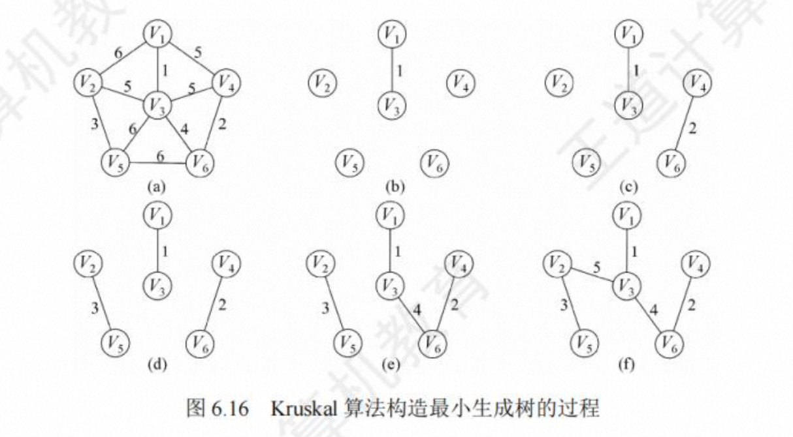
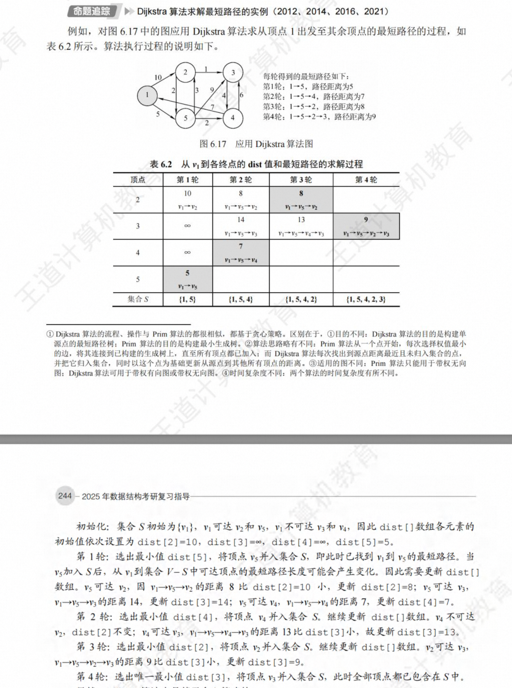
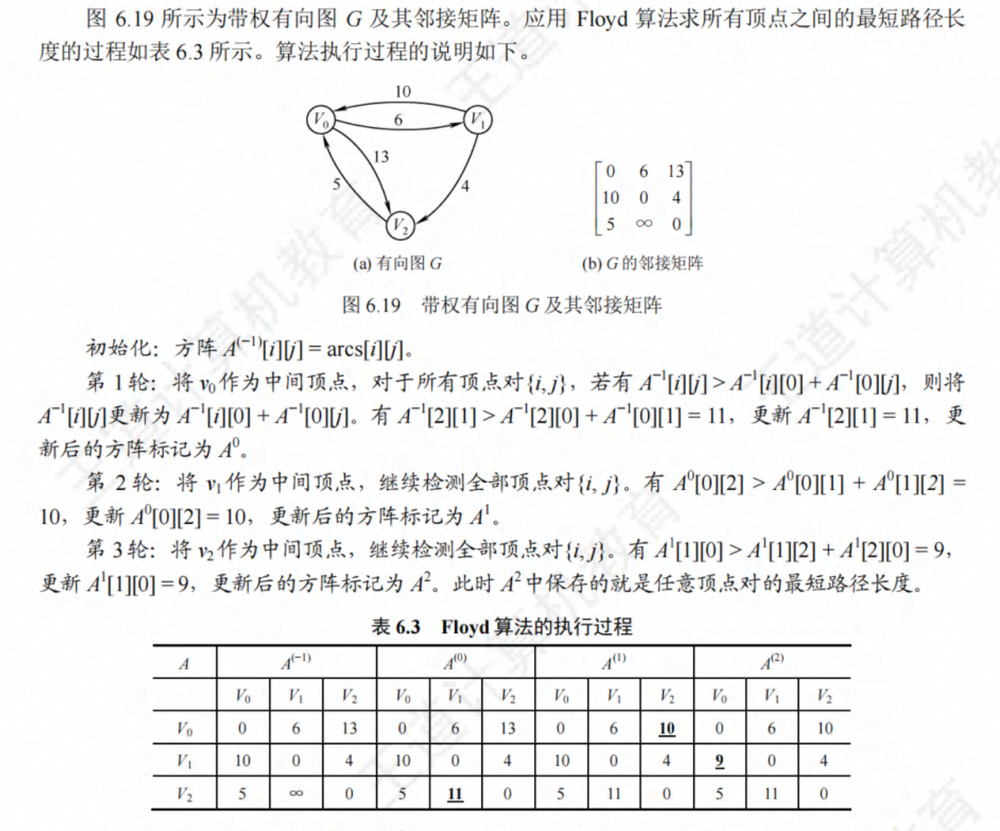

# 第 6 章 图

## 图的基本概念

#### 图的定义

图 G 由项点集和边集 E 组成，记为 G=(V,E)

线性表可以是空表，树可以是空树，但图不可以是空图。也就是说，图中不能一个顶点 也没有，图的顶点集 V 一定非空，但边集 E 可以为空，此时图中只有顶点而没有边。

1. **有向图**

2. **无向图**


3. **简单图、多重图**

一个图 G 若满足: 1️⃣ 不存在重复边; 2️⃣ 不存在顶点到自身的边，则称图 G 为简单图。图 6. 1 中 G1 和 G2
均内简单图

4. **完全图（简单完全图）**

对于无向图，|E|的取值范围为 0 到 n(n-1)/2，**有 n(n-1)/2 条边的无向图称完全图**，**在完全图中任意两个项点之间都存在边**。对于有向图，|E|的取值范围为 0 到 n(n-1)，**有 n(n-1)条弧的有向图称为有向完全图**，在有向完全图中任意两个顶点之间都存在方向相反的两条弧。图 6.1 中 G2 为无向完全图，而 G3 为有向完全图。

5. **子图**

   G3 为 G1 的子图

6. **连通、连通图和连通分量**

在**无向图**中，若从顶点 v 到顶点 w 有路径存在，则称 v 和 w 是连通的。若图 G 中任意两个顶点都是连通的 ， 则称图 G 连通图，否则称非连通图。无向图中的极大连通子图称连通分量，在图 6.2(a)中，图 G4 有 3 个连通分量如图 6.2(b)所示。假设一个图有 n 个顶点，若边数小于 n-1，则此图必是非连通图;思考，若图是非连通图，则最多可以有多少条边?


7. **强连通图、强连通分量**

在**有向图**中，若有一对顶点 w 和 w，从 v 到 w 和从 w 到 v 之间都有路径，则称这两个顶点是**强连通**的。**若图中任意一对项点都是强连通的，则称此图为强连通图**。**有向图中的极大强连通子图称为有向图的强连通分量**，图 G，的强连通分量如图 6.3 所示。思考，假设一个有向图有 n 个项点，若是强连通图，则最少需要有多少条边

8. **生成树、生成森林**

连通图的生成树是包含图中全部顶点的一个极小连通子图。若图中顶点数为 n，则它的生成树含有 n-1 条边。包含图中全部顶点的极小连通子图，只有生成树满足这个极小条件，对生成树而言，若砍去它的一条边，则会变成非连通图，若加上一条边则会形成一个回路。在非连通图中，连通分量的生成树构成了非连通图的生成森林。图 G 的一个生成树如图 6.4 所示。


> 区分极大连通子图和极小连通子图。极大连通子图要求子图必须连通，而且包含尽可能 多的顶点和边;极小连通子图是既要保持子图连通又要使得边数最少的子图

9. **顶点的度、入度和出度**

在**无向图**中，顶点 v 的度是**指依附于项点的边的条数**，记为 TD(v)。在图 6.1(b)中，每个项点的度均为 3。**无向图的全部顶点的度之和等于边数的 2 倍**，因为每条边和两个项点相关联。
在**有向图**中，顶点 v 的度分为入度和出度，**入度是以顶点终点的有向边的数目**，记为 ID(1):而**出度是以顶点，为起点的有向边的数目**，记为 OD(v)。在图 6.1(a)中，顶点 2 的出度为 2、入度为 1。顶点 v 的度等于其**入度与出度之和**，即 TD(v)=ID(v)+OD(v)。**有向图的全部顶点的入度之和与出度之和相等，并且等于边数，这是因为每条有向边都有一个起点和终点**。

10. **边的权和网**

在一个图中，每条边都可以标上具有某种含义的数值，**该数值称为该边的权值**。这种边上 带有权值的图称为**带权图，也称网**。

11. **稠密图、稀疏图**

边数很少的图称为稀疏图，反之称为稠密图。稀疏和稠密本身是模糊的概念，稀疏图和稠 密图常常是相对而言的。一般当图 G 满足 E<|7log|V 时，可以将 G 视为稀疏图。

12. **路径、路径长度和回路**

顶点 v，到顶点 1，之间的一条路径是指顶点序列 1pVV。，当然关联的边也可理解为路径的构成要素。路径上的边的数目称内**路径长度**。**第一个顶点和最后一个项点相同的路径称为回路或环**。若一个图有 n 个项点，且有大于 n-1 条边，则此图一定有环。

13. **简单路径、简单回路**

在路径序列中，顶点不重复出现的路径称为简单路径。除第一个顶点和最后一个顶点外， 其余顶点不重复出现的回路称为简单回路。

14. **距离**

从顶点 w 出发到顶点 v 的最短路径若存在，则此路径的长度称为从 u 到 v 的距离。若从 w 到 v 根本不存在路径，则记该距离为无穷(∞)

16. **有向树**

一个项点的入度为 0、其余顶点的入度均为 1 的有向图，称为有向树。

## 图的存储及基本操作

#### 邻接矩阵法

所谓邻接矩阵存储，是指用**一个一维数组存储图中顶点的信息**，**用一个二维数组存储图中边的信息(即各顶点之间的邻接关系)**，存储顶点之间邻接关系的二维数组称为邻接矩阵。

对带权图而言，若顶点 Vi 和 Vj 之间有边相连，则邻接矩阵中对应项存放着该边对应的权值，若顶点 Vi 和 Vj 不相连，则通常用 0 或 ∞ 来代表这两个项点之间不存在边。



```c
#deinfen MaxVertexNum 10;    //  顶点数目的最大值
typedef char VertexType;  // 顶点对应的数据类型
typedef int EdgeType;    // 边对应的数据类型
typedef struct {
   VertexType vex[MaxVertexNum];  // 顶点表
   EdgeType edge[MaxVertexNum][MaxVertexNum];  // 邻接矩阵、边表
   int vexnum,arcnum;   // 图的当前顶点数和边数
}MGraph;

```

> 1️⃣ 在简单应用中，可直接用二维数组作为图的邻接矩阵(顶点信息等均可省略)。
> 2️⃣ 当邻接矩阵的元素仅表示相应边是否存在时，EdgeType 可用值为 0 和 1 的枚举类型。
> 3️⃣ 无向图的邻接矩阵是对称矩阵，对规模特大的邻接矩阵可采用压缩存储。
> 4️⃣ 邻接矩阵表示法的空间复杂度为 O(n-)，其中 n 为图的顶点数|M。

> 邻接矩阵的遍历的时间复杂度

图的邻接矩阵存储表示法具有以下特点:

1️⃣ **无向图的邻接矩阵一定是一个对称矩阵(并且唯一)**。因此，在实际存储邻接矩阵时只需存储上(或下)三角矩阵的元素。
2️⃣ 对于无向图，邻接矩阵的第 i 行(或第 i 列)非零元素(或非 ∞ 元素)的个数正好是顶点 i 的度 TD(v)。
3️⃣ 对于有向图，邻接矩阵的第 i 行非零元素(或非 ∞ 元素)的个数正好是顶点 i 的出度 OD(v)；第 i 列非零元素(或非 ∞ 元素)的个数正好是顶点 i 的入度 ID(Vi)；
4️⃣ 用邻接矩阵存储图，很容易确定图中任意两个项点之间是否有边相连。但是，要确定图中有多少条边，则必须按行、按列对每个元素进行检测，所花费的时间代价很大。
5️⃣ 稠密图(即边数较多的图)适合采用邻接矩阵的存储表示。
6️⃣ 设图 G 的邻接矩阵为 A，**A^n 的元素 A^n[j][j] 等于由顶点 i 到顶点 j 的长度为 n 的路径的数目 **

#### 邻接表法

所谓邻接表，是指对图 G 中的每个顶点 Vi 建立一个单链表，第 i 个单链表中的结点表示依附于顶点 Vi 的边(对于有向图则是以顶点 Vi 为尾的弧)，这个单链表就称为顶点 Vi 的边表(对于有向图则称出边表)。边表的头指针和顶点的数据信息采用顺序存储，称为顶点表，所以在邻接表中存在两种结点:顶点表结点和边表结点，如图 6.6 所示。




```c
#define MaxVertexNum 100; //图中顶点数目的最大值

typedef struct ArcNode {.  // 边表结点
   int adjvex;             // 该弧指向的顶点的位置
   struct ArcNode *nextarc // 指向下一条的指针
   // InfoType info;       // 网的边权值
}ArcNode

typedef struct VNode{     // 顶点表结点
   VertexType data;       // 顶点信息
   ArcNode *firstarc;     // 指向第一条依附该顶点的弧的指针
}VNode, AdjList[MaxVertexNum]

typedef struct {
   AdjList vertices;  // 邻接表
   int vexnum , arcnum; // 图的顶点数和弧数
} ALGraph              //ALGr aph 是以邻接表存储的图类型
```

**特点：**

- 若 G 为无向图，则所需的存储空间为 **O(|V|+2|E|)**；若 G 为有向图，则所需的存储空间为 **O(|V|+|E|)**。前者的倍数 2 是因为在无向图中，每条边在邻接表中出现了两次。
- 对于**稀疏图(即边数较少的图)**，采用邻接表表示将极大地节省存储空间。
- 在邻接表中，给定一个顶点，**能很容易地找出它的所有邻边**，因为只需要读取它的邻接表。在邻接矩阵中，相同的操作则需要扫描一行，花费的时间为 O(n)。但是，若要确定给定的两个顶点间是否存在边，则在邻接矩阵中可以立刻查到，而在邻接表中则需要在 相应结点对应的边表中查找另一结点，效率较低。
- 在无向图的邻接表中，求某个项点的度只需计算其邻接表中的边表结点个数。在有向图的邻接表中，求某个顶点的出度只需计算其邻接表中的边表结点个数;但求某个顶点 x 的入度则需遍历全部的邻接表，统计邻接(adjvex )域为 × 的边表结点个数。
- 图的邻接表表示并不唯一，因为在每个顶点对应的边表中，各边结点的链接次序可以是任意的，它取决于建立邻接表的算法及边的输入次序。

#### 十字链表

为了解决有向图求入度需要遍历整个邻接表问题，引出了十字链表。十字链表是有向图的一种链式存储结构。在十字链表中，有向图的每条弧用一个结点(弧结点)来表示，每个顶点也用一个结点 (顶点结点)来表示。两种结点的结构如下所示。


弧结点中有 5 个域:
`tailvex`和`headvex`两个域分别指示**弧尾**和**弧头**这两个顶点的编号;
头链域 `hlink`指向**弧头相同**的下一个弧结点;
尾链域`tlink`指向**弧尾相同**的下一个弧结点;
`info` 域存放该弧的相关信息。
这样，**弧头相同的弧在同一个链表上**，**弧尾相同的弧也在同 一个链表上**。

顶点结点中有 3 个域：
`data `域存放该顶点的数据信息，如顶点名称;
`firstin`域指向以该顶点为弧头的第一个弧结点;
`firstout`域指向以该顶点为弧尾的第一个弧结点。



在十字链表中，既容易找到 Vi 为尾的弧，也容易找到 Vi 为头的弧，因而容易求得顶点的出度和入度。**图的十字链表表示是不唯一的，但一个十字链表表示唯一确定一个图**。

#### 邻接多重表

邻接多重表是**无向图**的一种链式存储结构。在邻接表中，容易求得顶点和边的各种信息， **但在邻接表中求两个项点之间是否存在边而对边执行删除等操作时**，需要分别在**两个顶点的边表中遍历**，效率较低。与十字链表类似，在邻接多重表中，每条边用一个结点表示，


在邻接多重表中，所有依附于同一顶点的边串联在同一链表中，因为每条边依附于两个顶点，所以每个边结点同时链接在两个链表中。对无向图而言，其邻接多重表和邻接表的差别仅在于，同一条边在邻接表中用两个结点表示，而在邻接多重表中只有一个结点。



图的四种存储方式总结


## 图的遍历

图的遍历是指从图中的某一项点出发，按照某种搜索方法沿着图中的边对图中的所有项点访问一次，且仅访问一次。
注意到树是一种特殊的图，所以树的遍历实际上也可视为一种特殊的图的遍历。图的遍历算法是求解图的连通性问题、拓扑排序和求关键路径等算法的基础。
图的遍历比树的遍历要复杂得多，因图的任意一个顶点都可能和其余的顶点相邻接，所以在访间某个顶点后，可能沿着某条路径搜索又回到该顶点。为避免同一顶点被访问多次，在遍历图的过程中，必须记下每个已访问过的项点，为此可以设一个辅助数组 visited[]来标记顶点是否被访问过。图的遍历算法主要有两种:**广度优先搜索和深度优先搜索**。

#### 广度优先搜索（BFS）

广度优先搜索(Breadth-First-Search, BFS)类似于二叉树的层序遍历算法。
基本思想：
1️⃣ 首先访问起始顶点 v，接着由 v 出发，依次访问 v 的各个未访问过的邻接顶点 W1，W2，...，Wi，
2️⃣ 然后依次访问 W1，W2，...，Wi 的所有未被访问过的邻接顶点
3️⃣ 再从这些访问过的项点出发，访问它们所有未被访问过的邻接顶点，直至图中所有项点都被访问过为止。
4️⃣ 若此时图中尚有顶点未被访问，则另选图中一个未曾被访问的项点作为始点，重复上述过程，直至图中所有顶点都被访问到为止。

广度优先搜索是一种分层的查找过程，每向前走一步可能访问一批顶点，不像深度优先搜索那样有往回退的情况，因此它不是一个递归的算法。为了实现逐层的访问，算法必须借助一个辅助队列，以记忆正在访问的顶点的下一层顶点。

```c
bool visited[MAX_VERTEX_NUM];      // 访问标记数组
void BFSTraverse(Graph G){         // 对图G进行广度优先遍历
   for(i = 0 ; i<G.vernum;i++){
      visited[i] = FALSE;          // 访问标记数组初始话
   }
   InitQueue(Q);                   // 初始话辅助队列Q
   for(i=0 ; i<G.vexnum ; i++){    // 从0号顶点开始遍历
      if(!visited[i]){             // 对每一个连通分量调用一下BFS
         BFS(G,i)
      }
   }
}

//用邻接表实现广度优先搜索的算法如下:
void BFS(ALGraph G , int i ){
   visit(i);                       // 访问顶点i
   visited[i] = TRUE;              // 对i做已访问标记
   EnQueue(Q,i);                   // 顶点i入队
   while(!IsEmpty(Q)){
      DeQueue(Q,v);                 // 队首顶点v出队
      for(p=G.vertices[v].firstarc;p;p=p->nextarc){// 检测v的所有邻接点
         w = p->adjvex;
         if(visited[w] == FALSE){
            visit(w);               // w为v的尚未访问的邻接点，访问w
            visited[w] = TRUE;      // 对w做已访问标记
            EnQueue(Q,w)            // 顶点w入队
         }
      }
   }

}
```

用**邻接矩阵**实现广度优先搜索的算法如下:

```c
 void BFS(MGraph G,int i) {
    visit (i) ;//访问初始顶点i
    visited[i]=TRUE; // //对i做已访问标记
    EnQueue (Q, i) : //顶点主入队
    while (!IsEmpty (Q)) {
       DeQueue (Q, v) ; // 队首顶点 出队
       for (w=0;w<G.vexnum; w++)//检测 的所有邻接点
           if(visited[w]==FAISE&&G.edge[v][w]==1){
               visit(w);   // w为v的尚未访问的邻接点，访问w
               visited[w]=TRUE;/对w做已访问标记
               EnQueue(Q,w);   // 顶点w入队
           }
    }
 }


```

辅助数组 visited[]标志顶点是否被访问过，其初始状态为 FALSE。在图的遍历过程中，一旦某个顶点 v;被访问，就立即置 visited[i]TRUE，防止它被多次访问。


图的广度优先搜索的过程与二叉树的层序遍历是完全一致的，图的广度优先搜索遍历算法是二叉树的层次遍历算法的扩展

1. **BFS 性能分析**
   无论是邻接表还是邻接矩阵的存储方式，BFS 算法都需要借助一个辅助队列 Q，n 个顶点均需入队一次，在最坏的情况下，空间复杂度为 O(V)。
   采用**邻接表**存储时，每个顶点均需搜索(或入队)一次，时间复杂度为 O(V)，在搜索每个顶点的邻接点时，每条边至少访问一次，时间复杂度为 O(E)，总的时间复杂度为 O(V+E)。采用**邻接矩阵**存储时，查找每个项点的邻接点所需的时间为 O(V)，总时间复杂度为 O(V^2)。

2. **BFS 求解单源最短路径问题**

使用 BFS，我们可以求解一个满足上述定义的韭带权图的单源最短路径问题，这是由广度优先搜索总是按照距离由近到远来遍历图中每个项点的性质决定的。

3. **广度优先生成树**

在广度遍历的过程中，我们可以得到一棵遍历树，称为广度优先生成树。 需要注意的是，**同一个图的邻接矩阵存储表示是唯一的，所以其广度优先生成树也是唯一的， 但因为邻接表存储表示不唯一，所以其广度优先生成树也是不唯一的**。


#### 深度优先搜索

与广度优先搜索不同，**深度优先搜索 (Depth-First-Search, DFS)类似于树的先序遍历**。

基本思想：
首先访问图中某一起始顶点 v，然后由 v 出发，访问与 v 邻接且未被访 问的任意一个顶点 w1，再访问与 w，邻接且未被访问的任意一个顶点 w2••• 重复上述过程。当不能再继续向下访问时，依次退回到最近被访间的顶点，若它还有邻接顶点未被访间过，则从该点开始继续上述搜索过程，直至图中所有顶点均被访问过为止。

深度优先搜索的过程:首先访问 a，并置 a 访问标记;然后访问与 a 邻接且未被访问的顶点 b，置 b 访问标记;然后访问与 b 邻接且未被访问的顶点 d，置 d 访问标记。此时 d 已没有未被访问过的邻接点，所以返回上一个访问的项点 b，访问与其邻接且未被访问的项点 e，置 e 访问标记，以此类推，直至图中所有项点都被访问一次。遍历结果为 abdehcg。

> 图的邻接矩阵表示是唯 一的，但对邻接表来说，若边的输入次序不同，则生成的邻接表 也不同。因此，对同样一个图，基于邻接矩阵的遍历得到的 DFS 序列和 BFS 序列是唯一的， 基于邻接表的遍历得到的 DFS 序列和 BFS 序列是不唯一的。

1. **DFS 的性能分析**
   DFS 算法是一个递归算法，需要借助一个递归工作栈，所以其空间复杂度为 O(IM)。
   采用邻接矩阵存储时，总时间复杂度为 `O(V^2)`。
   采用邻接表存储时，总的时间复杂度为 `O(V+E)`。
2. **深度优先的生成树和生成森林**
   

## 图 的遍历与图的连通性

图的遍历算法可以用来判断图的连通性。对于无向图来说，若无向图是连通的，则从任意一个结点出发，仅需一次遍历就能够访问图中的所有项点;若无向图是非连通的，则从某一个项点出发，一次遍历只能访问到该项点所在连通分量的所有顶点，而对于图中其他连通分量的顶点，则无法通过这次遍历访问。对于有向图来说，若从初始顶点到图中的每个顶点都有路径，则能够访问到图中的所有顶点，否则不能访问到所有顶点。
因此，在`BFSTraverse()`或`DFSTraverse()`中添加了第二个 for 循环，再选取初始点，继续进行遍历，以防止一次无法遍历图的所有项点。对于无向图，上述两个函数调用 BFS(G,i)或 DFS(G,i)的次数等于该图的连通分量数;而对于有向图则不是这样，因为一个连通的有向图分为强连通的和非强连通的，它的连通子图也分为强连通分量和非强连通分量，非强连通分量一次调用 BFS(G,1)或 DES(G，i)无法访问到该连通分量的所有顶点。

## 图的应用

图的应用主要包括:最小生成 (代价)树、最短路径、拓扑排序 和关键路径。

#### 最小生成树

一个连通图的生成树包含图的所有项点，并且只含尽可能少的边。对于生成树来说，若砍去它的一条边，则会使生成树变成非连通图;若给它增加一条边，则会形成图中的一条回路。

对于一个带权连通无向图 G，生成树不同，每棵树的权(即树中所有边上的权值之和)也可能不同。权值之和最小的那棵生成树称为 G 的最小生成树(Minimum-Spanning-Tree,MST)。

性质：
1️⃣ 若图 G 中存在权值相同的边，则 G 的最小生成树可能不唯一，即最小生成树的树形不唯一。当图 G 中的各边权值互不相等时，G 的最小生成树是唯一的;若无向连通图 G 的边数比顶点数少 1，即 G 本身是一棵树时，则 G 的最小生成树就是它本身。
2️⃣ 虽然最小生成树不唯一，但其对应的边的权值之和总是唯 一的，而且是最小的。
3️⃣ 最小生成树的边数为顶点数減 1。

> 最小生成树中某顶点到其他顶点是否具有最短路径的分析
> 

基于该性质的最小生成树算法主要有`Prim` 算法和`Kruskal`算法，它们都基于贪心算法的策略

1. **Prim 算法**


时间复杂度为 O(V^2),不依赖于 E，因此它适用于求解边稠密的图的最小生成树。

2. **Kruskal 算法**
   与 Prim 算法从顶点开始扩展最小生成树不同，Kruskal 算法是一种**按权值的递增次序选择合适的边来构造最小生成树的方法**。



在`Kruskal`算法中，最坏情况需要对|E|条边各扫描一次。通常采用堆(见第 7 章)来存放边的集合，每次选择最小权值的边需要 O(log2E)的时间;每次使用并查集来快速判断两个顶点是 否属于一个集合所需的时间为 O(aV)，a(V)的增长极其缓慢，可视为常数。算法的总时间复 杂度为 O(Vlog2E)，不依赖于|V|，因此 Kruskal 算法适合于**边稀疏而顶点较多的图**。

#### 最短路径

6.3 节所述的广度优先搜索查找最短路径只是对无权图而言的。当图是带权图时，把从一个顶点 vo 到图中其余任意一个顶点，的一条路径所经过边上的权值之和，定义为该路径的**带权路径长度**，**把带权路径长度最短的那条路径(可能不止一条)称为最短路径**。
求解最短路径的算法通常都依赖于一种性质，即两点之间的最短路径也包含了路径上其他项点间的最短路径。带权有向图 G 的最短路径问题一般可分两类:一是**单源最短路径**，即求图中某一顶点到其他各顶点的最短路径，可通过经典的` Dijkstra(迪杰斯特拉)`算法求解;二是求**每对顶点间的最短路径**，可通过 `Floyd(弗洛伊德)`算法来求解。

1. **Dijkstra 算法求单源最短路径问题**
   `Dijkstra` 算法设置一个集合 S 记录已求得的最短路径的顶点，初始时把源点 Vo 放入 S，集合 S 每并入一个新顶点 Vi，都要修改源点 Vo 到集合 V—S 中顶点当前的最短路径长度值
   在构造的过程中还设置了三个辅助数组:

- `final[]`:标记各顶点是否已找到最短路径，即是否归入集合 S。
- `dist[]`:记录从源点 Vo 到其他各顶点当前的最短路径长度，它的初始值为:若从 Vo 到 Vi 有弧，则 `dist[i]`弧上的权值;否则置 `dist[i ]为∞`。
- `path[]`:`path[i]`表示从源点到顶点 Vi 之间的最短路径的前驱结点。在算法结束时，可根据其值追溯得到源点 Vo 到顶点 Vi 的最短路径。

> Dijkstra 算法求解最短路径的实例 (2012、2014、2016、2021)
> 

显然，`Dijkstra` 算法也是基于贪心策略的。
使用**邻接矩阵**表示时，时间复杂度为 O(V^2)。
使用带权的**邻接表**表示时，虽然修改 dist[]的时间可以减少，但由于在 dist[]中选择最小分量的时间不变，所以时间复杂度仍为 O(V^2);

**边上带有负权值时，Dijkstra 算法并不适用。**

2. **Floyd 算法求各顶点之间最短路径问题**

求所有顶点之间的最短路径问题描述如下:已知 一个各边权值均大于 0 的带权有向图，对任意两个顶点 Vi!=Vj，要求求出 Vi 与 Vj 之间的最短路径和最短路径长度。


**求最短路径的总结**


#### 有向无环图描述表达式


