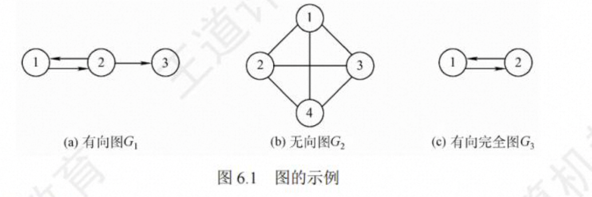

# 第 6 章 图

## 图的基本概念

#### 图的定义

图 G 由项点集和边集 E 组成，记为 G=(V,E)

线性表可以是空表，树可以是空树，但图不可以是空图。也就是说，图中不能一个顶点 也没有，图的顶点集 V 一定非空，但边集 E 可以为空，此时图中只有顶点而没有边。

1. **有向图**

2. **无向图**

3. **简单图、多重图**

一个图 G 若满足: 1️⃣ 不存在重复边; 2️⃣ 不存在顶点到自身的边，则称图 G 为简单图。图 6. 1 中 G1 和 G2
均内简单图

4. **完全图（简单完全图）**

对于无向图，|E|的取值范围为 0 到 n(n-1)/2，**有 n(n-1)/2 条边的无向图称完全图**，**在完全图中任意两个项点之间都存在边**。对于有向图，|E|的取值范围为 0 到 n(n-1)，**有 n(n-1)条弧的有向图称为有向完全图**，在有向完全图中任意两个顶点之间都存在方向相反的两条弧。图 6.1 中 G2 为无向完全图，而 G3 为有向完全图。

5. **子图**

   G3 为 G1 的子图

6. **连通、连通图和连通分量**

在**无向图**中，若从顶点 v 到顶点 w 有路径存在，则称 v 和 w 是连通的。若图 G 中任意两个顶点都是连通的 ， 则称图 G 连通图，否则称非连通图。无向图中的极大连通子图称连通分量，在图 6.2(a)中，图 G4 有 3 个连通分量如图 6.2(b)所示。假设一个图有 n 个顶点，若边数小于 n-1，则此图必是非连通图;思考，若图是非连通图，则最多可以有多少条边?

7. **强连通图、强连通分量**

在**有向图**中，若有一对顶点 w 和 w，从 v 到 w 和从 w 到 v 之间都有路径，则称这两个顶点是**强连通**的。**若图中任意一对项点都是强连通的，则称此图为强连通图**。**有向图中的极大强连通子图称为有向图的强连通分量**，图 G，的强连通分量如图 6.3 所示。思考，假设一个有向图有 n 个项点，若是强连通图，则最少需要有多少条边
