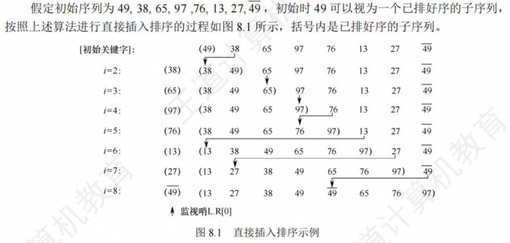
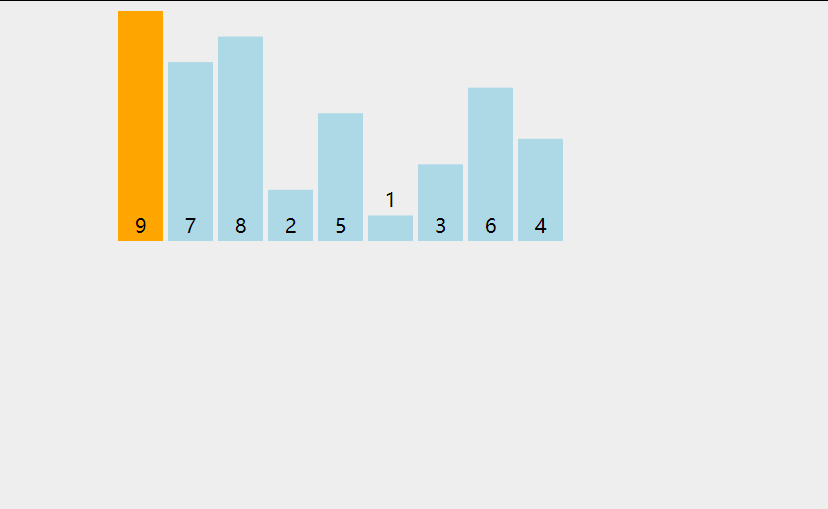
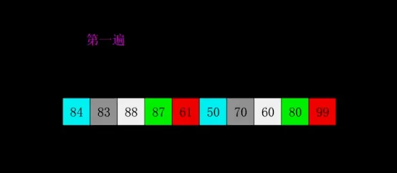

# 第 8 章 排序

## 排序的基本概念

排序，就是重新排列表中的元素，使表中的元素满足按关键字有序的过程。为了查找方便，通常希望计算机中的表是按关键字有序的。

算法的稳定性。排序前后关键字相同的位置不变，即算法稳定，否则不稳定。

在排序过程中，根据数据元素是否完全存放在内存中，可将排序算法分为两类:1 内部排序， 是指在排序期间元素全部存放在内存中的排序;2 外部排序，是指在排序期间元素无法全部同时 存放在内存中，必须在排序的过程中根据要求不断地在内、外存之间移动的排序。

一般情况下，内部排序算法在执行过程中都要进行两种操作:比较和移动。通过比较两个关键字的大小，确定对应元素的前后关系，然后通过移动元素以达到有序。当然，并非所有的内部排序算法都要基于比较操作，事实上，基数排序就不基于比较操作

## 插入排序

插入排序是一种简单直观的排序算法，其基本思想是每次将一个待排序的记录按其关键字大小插入前面已排好序的子序列，直到全部记录插入完成。由插入排序的思想可以引中出三个重要的排序算法:直接插入排序、折半插入排序和希尔排序。

#### 直接插入排序





```c
void InsertSort(Elemtype A[],int n){
  int i,j;
  for(i=2 ;i<=n;i++){             // 依 次 将 A [ 2 ] ~A [ n ] 插 入 前 面 已 排 序 序 列
    if(A[i] < A[i-1]){            // 若 A [i ]关键 码 小 于其 前 驱 ， 将 A [i ]插 入有 序 表
      A[0] = A[i];                // 复制为哨兵，A[0]不存放元素
      for(j=i-1;A[0]<A[j];j--){   // 从后往前査 待插入位置
        A[j+1] = A[j]             //  向后挪位
      }
      A[j+1] = A[0]               // 复制到插入位置
    }
  }
}
```

**空间复杂度：O(1)**
**时间复杂度：O(n^2)**
**稳定性： 稳定**

#### 折半插入排序

**先用折半查找来实现。确定待插入位置后，就可统一地向后移动元素**

```c
void InsertSort(ElemType A[] , int n ){
  int i,j,low,high,mid;
  for(i=2;i<-n;i++){
    A[0] = A[i];
    low = 1;
    high = i-1;
    while(low<high){
      mid = (low + high) / 2;
      if(A[mid] > A[0]) high = mid -1;
      else low = mid+1
    }
    for(j=i-1; j>=high+1;--j){
      A[j+1] = A[j];
    }
    A[high+1] = A[0];
  }
}
```

> 直接插入排序和折半插入排序的比较

折半插入排序仅减少了比较元素的次数,时间复杂度约为 O(nlog2n)，该比较次数与待排序表的初始状态无关，仅取决于表中的元素个数 n，而元素的移动次数并未改变，它依赖于待排序表的初始状态，因此，折半插入排序的时间复杂度仍为 O(n^2)

**空间复杂度：O(1)**
**时间复杂度：O(n^2)**
**稳定性： 稳定**

#### 希尔排序(缩小增量排序)

将带排序序列根据增量划分为子表，对各个子表分别直接插入排序，然后缩小增量，当整个表中数据基本有序，对全体进行一次直接插入排序。




**空间复杂度：O(1)**
**时间复杂度：O(n^2)**
**稳定性： 不稳定**

## 交换排序
