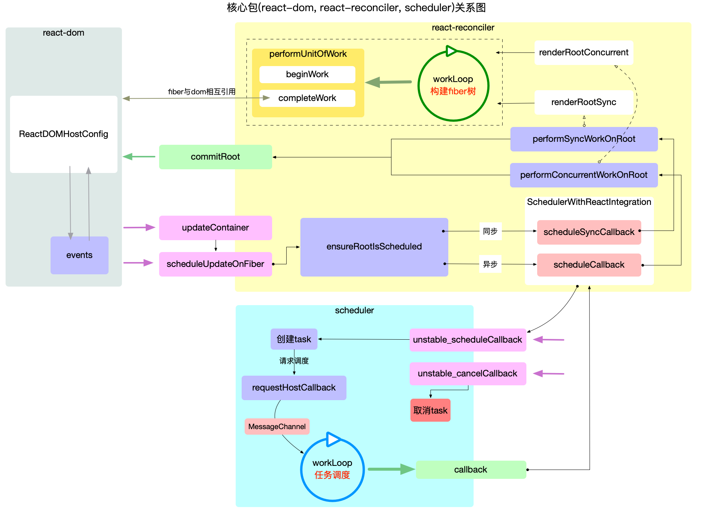
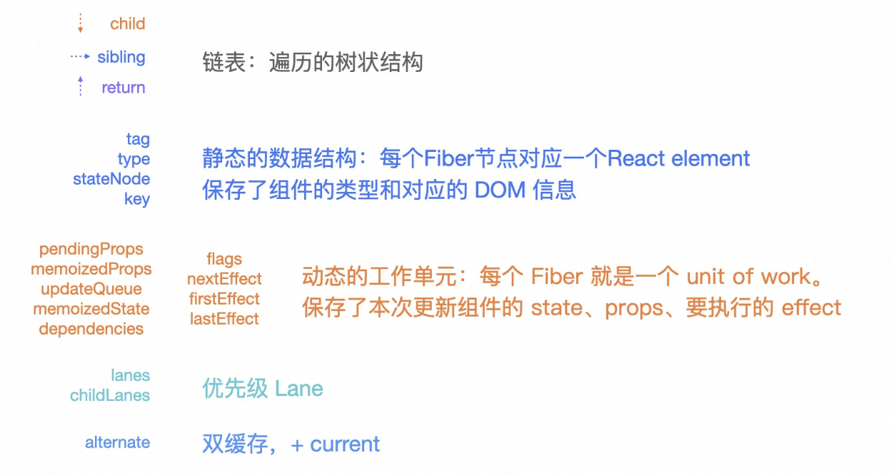
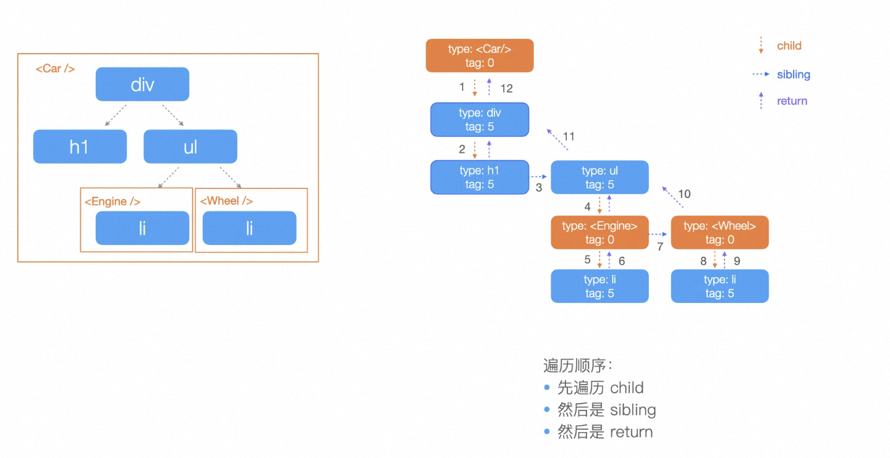

# 核心概念

## 核心包结构

1. **react**

   > react 基础包，提供创建 react 组件（`React.createElement`）、状态管理（`useState`）、生命周期（`useEffect`）等必要函数，开发过程中的使用的 api 主要都来自这个包。

2. **react-dom**

   > web 应用的**渲染器**，是 react 与 web 平台连接的桥梁(可以在浏览器和 nodejs 环境中使用)，将`react-reconciler`中的运行结果输出到 web 界面上，主要作用是将 React 组件转换为 DOM 节点，并渲染在浏览器上。在 React 18 中，更推荐使用的渲染 api 是 `createRoot.render`，在 concurrent 模式（并发模式）下性能更好。

3. **react-reconciler**

   > react 的核心包（**调度构造器**），通过实现协调算法（`diff 算法`）管理 react 应用状态的输入和结果的输出，构造 fiber 树， 将输入信号最终转换成输出信号传递给**渲染器**（`react-dom`）。主要功能作用：
   >
   > - 接受状态输入(`scheduleUpdateOnFiber`)，将 fiber 树生成逻辑封装到一个回调函数中(涉及 fiber 树形结构, fiber.updateQueue 队列, 调和算法等)
   > - 把此回调函数(`performSyncWorkOnRoot`或`performConcurrentWorkOnRoot`)送入`scheduler`进行调度
   > - 回调函数执行完成后获取到更新结果，交给**渲染器**（`react-dom`）渲染到页面上

4. **scheduler**

   > 调度机制的核心实现(**调度器**)，接收**react-reconciler**传入的回调函数任务，并管理这些任务的优先级和执行顺序。
   >
   > - 核心任务就是执行回调(回调函数由`react-reconciler`提供)
   > - 控制由`react-reconciler`送入的回调函数的执行时机, 在 concurrent 模式下可以实现任务分片, 实现可中断渲染(concurrent 模式下才有此特性)

## 架构分层

可将 react 应用整体结构分为接口层（`api`）和内核层（`core`）

1. **接口层（api）**
   react 包对外暴露 api

2. **内核层**
   由三部分组成，调度器（`scheduler`），调度构造器（`react-reconciler`），渲染器（`react-dom`）

**内核关系**

## 异步可中断更新

### 同步更新和异步更新的区别

如下图

输入框内输入的文字较多时，同步模式下就会出现明显的卡顿

### 对比同步与异步工作模式

**同步工作模式**

在该模式下，一旦开启，则不可中断，后续的浏览器事件(IO)都会被阻塞，需要等待整个 render 结束后才会处理

**异步可中断模式**

一个 fiber 就是一个最小的工作单元

render 阶段，为了避免出现浏览器事件(IO)长期得不到相应而出现的饥饿现象，故把整个 render 做时间切片 time-slicing，在每个时间片的末尾根据优先级查询当前是否有 IO 操作需要响应，如果有则转去处理 IO，当前 render 可暂停、继续、丢弃等，然后进行增量渲染。（关于饥饿现象、时间切片和可中断性可参考 OS）

Commit 阶段始终是同步的，目的就是为了将变化的部分一次性更新到 DOM 上

### Fiber 数据结构

### Fiber 树

type 表示组件的类型
tag 表示组件的类型

节点间的连接关系 child（孩子）、sibling（兄弟）、return（父亲）

并不是一个标准的树状结构，而是一个链表的结构，用一个链表来表示一棵树，他的好处就是能够做到单向遍历，每一步都可以做到暂停和恢复。

遍历顺序是深度优先（DFS）：先遍历所有的 child 节点、没有 child 节点就会去找兄弟节点 sibling、然后再是 child 节点，没有 child 节点就去找兄弟节点，没有兄弟节点就回去找 return（表示上一级的节点，并不是 parent）

从遍历顺序上看，Fiber 树实际上是用链表来表示的树

根据遍历顺序，以下的打印顺序是什么

### Fiber 双缓冲

初始 render 阶段，fiber 的 alternate 会绘制成完整的一个 Fiber 树，在 commit 阶段，Fiber 会把 current 节点指向 alternate 节点，做一次性的替换。

React 默认会创建 rootFiberNode，下面挂在 rootFiber，初次时，rootFiber 下面的 current 是空的（current 任何时候都是指向浏览器实际渲染的内容）。render 阶段，会在 alternate 节点开始计算生成完整的一个 Fiber 树，在 React 内部叫做 workInProgress 树，到了 commit 阶段，表示 workInProgress 树已经计算完成，它会把 alternate 节点浅 copy 到 rootFiber 的 current 节点，由于是浅 copy，整个速度是非常快的。

### Scheduler

React 调度包含两层工作循环 workloop：Scheduler 层和 Fiber(Reconciler) 层

workloop 为了避免对浏览器造成一个阻塞，使用 Scheduler shouldYeld 方法用来判断当前事件执行的时间是否超过阀值，默认阀值为 5 毫秒 ，如果一个计算任务的计算时长超过这个阀值，react 就是出让浏览器的执行权，让更高优先级的任务插入，保证页面的流畅性。

### Reconciler

### 整体流程

