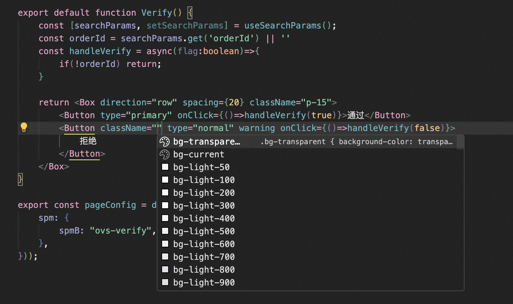

# unocss

文档：
https://unocss.nodejs.cn/#google_vignette

参考

- https://antfu.me/posts/reimagine-atomic-css-zh

原子化 CSS 是一种 CSS 写法，它将 CSS 样式拆分成一个个独立的样式，每个样式只包含一个属性，比如：

```css
/* 原子化 CSS */
.mt-10 {
  margin-top: 10px;
}
```

通过原子化 CSS 能力，可以方便地支持响应式布局，以及减少 CSS 文件体积。

## 配置 unocss vscode 插件

安装`UnoCSS`

在`setting.json`中加入以下

```json
"editor.quickSuggestions": {
        "other": true,
        "comments": true,
        "strings": true
      },
      "unocss.root": [

      ]
```

预览效果：



## rpx to vw vh

ice.js 原生支持 rpx 单位。在无线端中，阿里巴巴集团标准统一使用 rpx 作为响应式长度单位。你可以直接在样式文件中使用 rpx，不需要担心转换的问题。

- rpx（responsive pixel），可以根据屏幕宽度进行自适应。规定屏幕宽为 750rpx。以 iPhone6 为例，屏幕宽度为 375px，共有 750 个物理像素，则 750rpx = 375px = 750 物理像素，1rpx = 0.5px = 1 物理像素。

在浏览器中，ice.js 会将 rpx 会转换为 vw 进行渲染，其转换关系为：750rpx = 100vw，即 1rpx = 1/7.5vw，保留 5 位小数。小程序由于天然支持 rpx 单位，因此可以直接使用并且 ice.js 不会将其转换为 vw。
