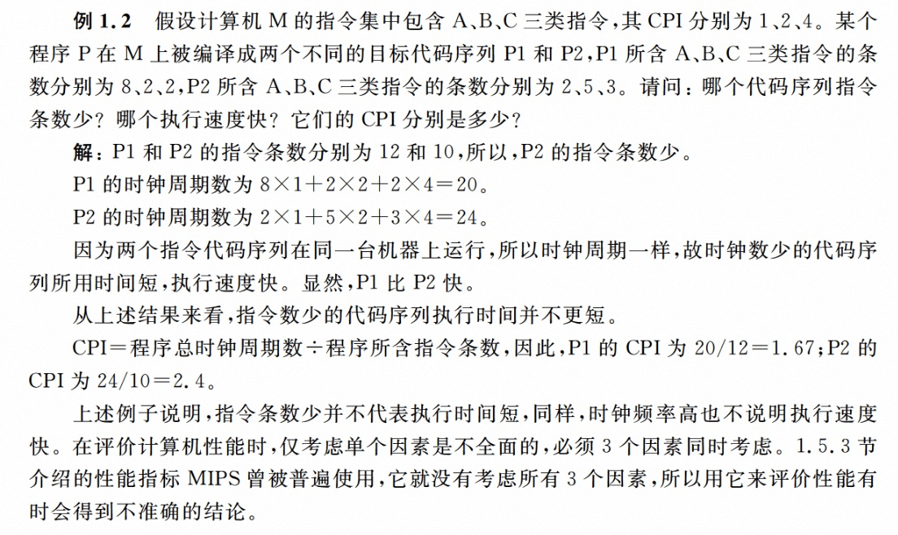

# 第一章 计算机系统概述

## 计算机的发展历程

第一代计算机：电子管计算机 其逻辑元件采用电子管，存储器为声延迟线或磁鼓，典型逻辑结构为定点运算。
冯诺依曼提出“存储程序”，其基本思想是：必须将事先编好的程序和原始数据送入主存后才能执行程序，一旦程序被启动执行，计算机在不需要操作人员干预自动完成逐条指令并执行的任务。
IAS 计算机：

第二代计算机：晶体管计算机 逻辑元件采用晶体管，其内存采用磁芯存储器，外存采用磁鼓与磁带存储器，实现了浮点数运算，并在系统结构方面提出了变址、中断、I/O 处理器等新概念。

第三代计算机：集成电路计算机 集成电路的应用时微电子与计算机技术相结合的一大突破，为构建运算速度快、价格低、容量大、可靠性高、体积小、功耗低的各类计算机提供了技术条件。

第四代计算机： 超大规模集成电路计算机

## 计算机系统的基本组成

计算机系统由硬件和软件两部分组成。

#### 计算机硬件

冯诺依曼计算机的基本特征：
(1) 采用“存储程序”工作方式
(2) 计算机由运算器、控制器、存储器、输入/输出设备 5 部分组成。
(3) 存储器不仅能存储数据，还能存放指令，形式上数据和指令没有区别，但计算机能区分它们。控制器应能控制指令的自动执行。运算器应能进行加、减、乘、除 4 种基本运算，并且能进行逻辑运算。操作人员可以通过输入/输出设备操作计算机。
(4) 计算机内部以二进制形式表示指令和数据，每条指令由操作吗和地址吗两部分组成，操作码指出操作类型，地址码指出操作数的地址，由一串指令组成程序。

计算机的硬件主要包括：中央处理器，存储器，I/O 控制器，外部设备和各类总线
中央处理器(CPU)：简称处理器，是整个计算机的核心部件 ，主要用于指令的执行。CPU 包括两种基本部件：数据通路和控制器。数据通路主要包括算数逻辑部件和通用寄存器等，其功能是用来执行算术和逻辑运算等操作。控制器 用来对指令进行译码，生成相应的控制信号，以控制数据通路正确的操作。
存储器：外存和内存。内存：主存储器和高速缓存 cache 外存：辅助存储器和海量后备存储器
外部设备：外设 也称为 I/O 设备 I/O 是输入输出的缩写。外设由机械部分和电子部分组成，机械部分是外部设备本身，电子部分是控制外部设备的 I/O 控制器或 I/O 适配器
总线：传输信息的介质，用于在部件之间传输信息，CPU、主存和 I/O 模块通过总线互连，在 CPU 和 I/O 模块中都含有相应的存储部件，即缓存器。

#### 计算机软件

根据用途分：系统软件和应用软件
系统软件：操作系统、语言处理系统(如 C 语言编译器)、数据库管理系统(如 Oracle)和各类实用程序(如磁盘碎片整理程序、备份程序)
应用软件：专门为处理数据处理、科学计算、事务管理、多媒体处理、工程设计以及过程控制等应用所编写的各类程序

## 计算机系统的层次结构

向上层用户提供一个抽象的简洁接口而将较低层次的实现细节隐藏起来

#### 计算机系统抽象层的转换

高级语言和低级语言(机器级语言)
机器级语言：机器语言（可读性差 由 0 1 组成）和汇编语言（由英文符号和二进制代码）；
高级语言 -> 机器语言
转换过程需要 “程序设计语言处理系统” 其包含翻译程序（将一种编程语言转换成另一种编程语言）
翻译程序：
(1) 汇编程序：也成汇编器 将汇编语言源程序翻译为机器语言目标程序
(2) 解释程序：解释器 将源程序中的语句将其执行顺序逐条翻译为机器指令并立即执行。
(3) 编译程序：编译器 将高级语言源程序翻译成汇编语言或机器语言目标程序

透明：一个存在的事物或概念从某个角度看似乎不存在，即，对实际存在事物或概念感觉不到，则称为透明 对用户透明 指用户看不见

## 程序开发与执行过程

#### 从源程序到可执行程序

(1) 通过程序编辑软件(vscode)的到 hello.c 文件,hello.c 文件在计算机中以 ASCII 字符方式存放 这样的文件称为文本文件，源程序文件都是文本文件，是可显示和可读的

(2)预处理阶段：预处理程序 do...
(3)编译阶段:编译程序 do...
(4)汇编阶段:汇编程序 do...
(5)链接阶段:链接程序 do...
最终生成的可执行文件被保存在磁盘上，可以通过某种方式启动一个磁盘上的可执行文件

#### 可执行文件的启动和执行

#### 程序与指令的关系

#### 指令执行的过程

第一步：根据 Pc 取指令到 IR
第二步：指令译码并送出控制信号。
第三步：取操作数。
第四步：指令执行。
第五步：回写结果。

## 计算机系统性能评价

#### 计算机性能的定义

吞吐率和响应时间是考量一个计算机系统性能的两个基本指标。
吞吐率：也称为带宽 表示在单位时间内所完成的工作量。
响应时间：也称为执行时间或等待时间，指从作业提交开始到作业完成所用的时间。

MAR 位数反应存储单元的个数（最多支持多少个）

MDR 位数 = 存储字长 = 每个存储单元的大小

总容量 = 存储单元个数 ✖️ 存储字长

#### 计算机性能的测试

CPU 时间：CPU 用于程序执行的时间，包含两部分
(1)用户 CPU 时间，指真正用于运行用户程序代码的时间
(2)系统 CPU 时间，指为了执行用户程序而需要 CPU 运行操作系统的时间。
其他时间：I/O 操作，CPU 执行其他用户程序的时间

CPU 时间的衡量:
(1)时钟周期：计算机执行一条指令的过程被分成若干步骤和相应的动作来完成，每个动作都要由响应的控制信号进行控制，控制信号都要由定时信号进行同步，定时信号就是 CPU 的主脉冲信号，其宽度称为时钟周期。
(2)时钟频率：CPU 的主频就是 CPU 中的主脉冲信号的时钟频率，是 CPU 时钟周期的倒数。
(3)CPI：表示执行一条指令所需的时钟周期数。
CPU 执行时间 = 程序所含时钟周期数 ➗ 时钟频率
= 程序所含时钟周期数 ✖️ 时钟周期
程序总时钟周期数 = 程序所含指令条数 ✖️ CPI
n 种不同类型的指令，第 i 种指令的条数和 CPI 分别为 Ci 和 CPIi
程序总时钟周期数 = C1*CPI1 + C2*CPI2+ C3*CPI3 + ... + Cn*CPIn
平均 CPI = 程序总时钟周期数 ➗ 程序所含指令条数
例 1:

例 2:

#### 用指令执行速度进行评估

MIPS：平均每秒钟执行多少百万条指令
MIPS = 1/一条指令的平均执行时间
MFLOPS：每秒所执行的浮点运算有多少百万次
GFLOPS：10^9
TFLPOS:10^12
PFLOPS:10^15

#### 用基准程序进行性能评估

基准程序：
课后习题：

#### 计算机性能指标

**存储器容量**

MAR 的位数反应存储单元数量

MDR 的位数反应每个存储单元大小

**CPU**

时钟周期：CPU 中国呢最小的时间单位，每个动作至少一个时钟周期

主频（时钟频率）：1/时钟周期，单位 Hz

CPI：执行一条指令所需的时钟周期数

CPU 执行时间：运行一个程序所花的时间 = （指令条数 \* CPI）/ 主频

IPS：每秒执行多少条指令 = 主频 / 平均 CPI

FLOPS：每秒执行多少次浮点数运算

数据通路宽度、吞吐量、响应时间、基准程序

**常用数量单位**

描述存储容量、文件大小：K = 2^10 ,M = 2^20, G = 2^30,T = 2^40

描述速率、频率：K = 10^3 M = 10^6. G = 10^9 T = 10 ^ 12 P = 2^15 E = 2^18 Z = 2^21

亿 = 10^8
